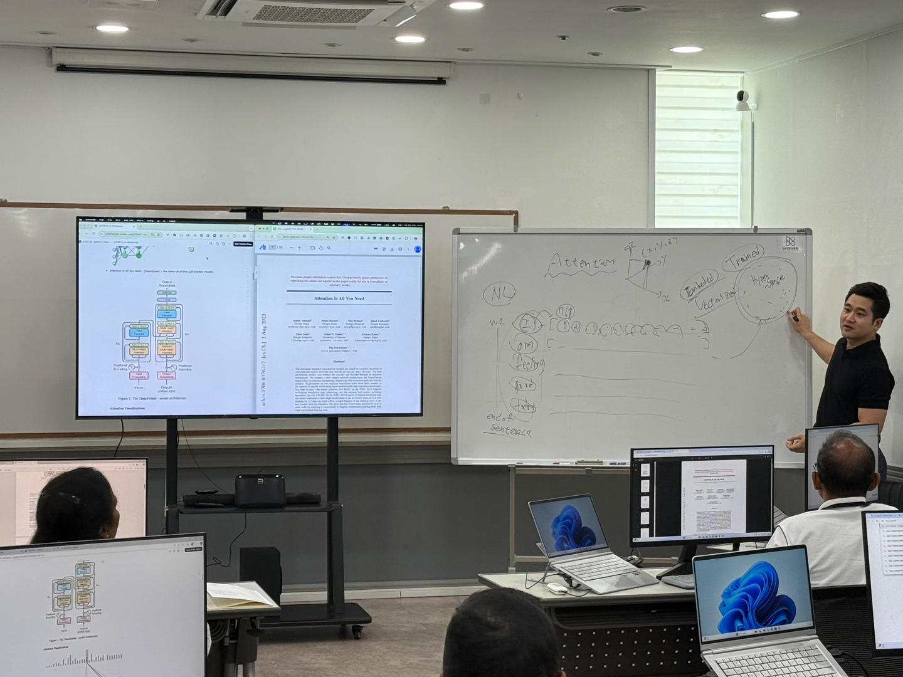
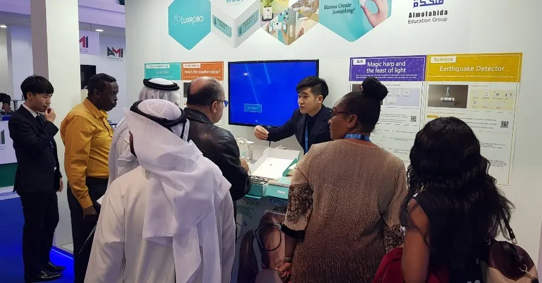
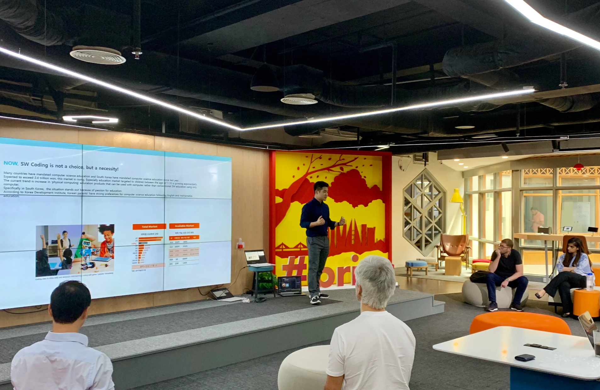
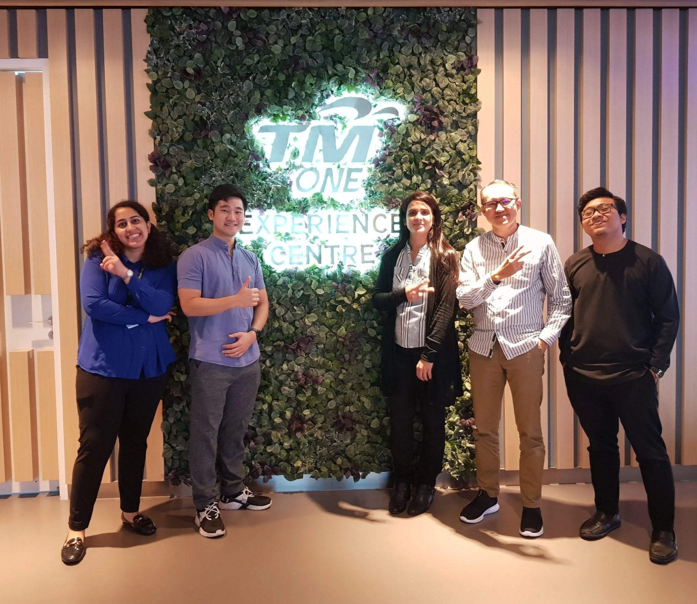
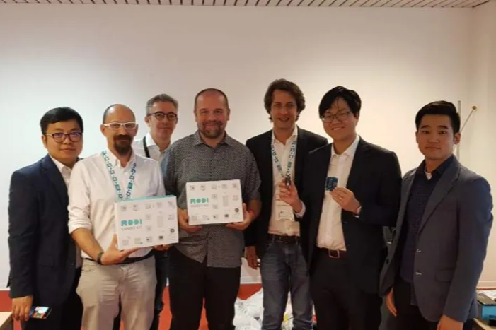
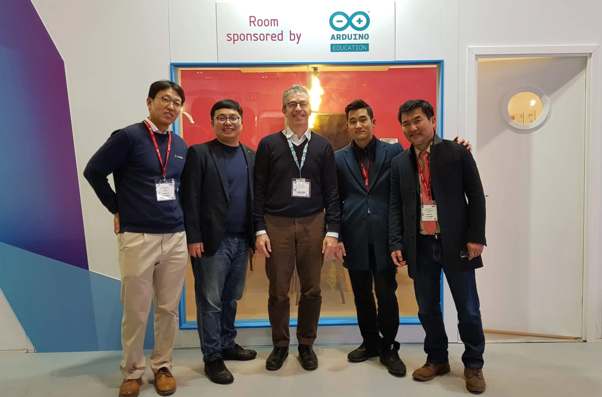

---

## title: 박병준 AI & IT 컨설턴트 프로필

 :linkedin_icon-svg: [linkedin.com/in/pbjworking](https://www.linkedin.com/in/pbjworking/) \| E. [prfsr.limitless@gmail.com](mailto:prfsr.limitless@gmail.com) {color="green_bg"} ## 교육 사항 - **2025.08 - **AI 빅데이터 MS & MBA > aSSIST, SDG MS (Switzerland, Geneva) - **2023.08 - **컴퓨터과학 BA > **한국방송통신대학교** - **2016.02 - **정치외교학, 신문방송학 BA > **서강대학교** - **2008.02 - **중국어 전공 > **서울외국어고등학교** ## **자격 사항** - **2024.06 ** > AWS Certified Solutions Architect Associate  
`Amazon Web Service` - **2023.06** > AWS Certified Cloud Practitioner  
`Amazon Web Service` - **2021.06** > 정보처리기사  
`한국산업인력공단` - **2017.07** > 국가공인 SQL 개발자  
`한국데이터진흥원` --- # 급변하는 기술 생태계를 뉴스 속도로 업데이트하는 교육 - AI·빅데이터·클라우드 생태계의 최신 도구를 **지속적으로 탐색하고 개발과 교육에 뉴스 속도로 적용** *\***`Cursor`**, **`Claude Code`**, **`Antigravity`**, **`OpenCode`**, **`OMO`**, **`OpenClaw`**, **`Knowledge Base`** 등 AI 개발도구 및 트렌드의 흐름을 진행 중인 교육과정에 즉시 도입하는 뉴스 레벨의 최신 교육 진행* - 교육 현장과 기술 실무 양쪽을 잇는 **가교 역할**을 통해 학습자와 조직 모두의 성장을 촉진 *\*현업 엔지니어링 솔루션을 그대로 다루는 실무형 교육자료와 현장 교육생 니즈를 실시간으로 반영한 교육* # 수료율 100%의 학습자 맞춤, 미래기술+실전기술 융합 교육 - 기술 교육자로서 **복잡한 개념을 명확하게 전달**하고, 개인별 학습 목표에 맞춘 **맞춤형 성장 경로 설계를 지원** [2024 & 2025년 KDT 장기과정 2기수 연속 100% 수료](pages/2024-2025년-kdt-장기과정-2기수-연속-100-수료.md) - 실습 중심의 기획·AI·클라우드·백엔드 교육을 **직접 설계·진행**하며, 현장에 즉시 적용 가능한 학습자 역량 배양 *\*기업 IT 실무자 교육의 현장 중심적 니즈를 완벽히 반영한 기술요소 특강으로 ****최고 수준의 만족도 달성***  - K-12 학생부터 대학생, 현직 기술 전문가에 이르기까지 **모든 수준의 학습자를 위한 체계적 교육과 멘토링 제공** *\*미국 인디애나 주 초중고 및 퍼듀 대학교, 입직자 취업준비 교육 및 진로 멘토링과 특강, 현직자 기술교육까지* # 확장성과 안정성 설계 기술력으로 장애율 0%의 엔지니어링 - 클라우드, 데이터 엔지니어링, 소프트웨어 개발에 걸친 **실무 경험 기반 확장 가능한 시스템 설계·구현** *\*****DAU 300만 이상****의 코인거래소 실시간 알림 시스템과 광고 시스템에서 대량의 트래픽 제어* - 클라우드 환경에서의 **배포 및 운영을 주도**하며 안정성과 효율성을 극대화 ### *\*(주)키즈노트 2022-2024 광고시스템 ****리뉴얼 프로젝트 런칭 후 2년간 개발 장애율 0%***  - **데이터 파이프라인 최적화와 분산 아키텍처 설계**를 통해 조직의 기술적 성장을 견인 *\*MSA 시스템의 설계와 구축, Kafka 기반의 이벤트 스트리밍 시스템 구축 및 관련 기술 재직자 직무 교육 수행* --- # **강의 및 교육 경력**

|                                                                 |                    |          |
| --------------------------------------------------------------- | ------------------ | -------- |
| 강의 및 교육 활동                                                      | 기간                 | 운영기관     |
| 모두의연구소 AI 활용 서비스 기획/개발 전문가 과정 (직장인 바이브코딩 실전 프로젝트 과정) - 5기       | 2026.03 \~ 2026.06 | 모두의연구소   |
| 모두의연구소 AI 활용 서비스 기획/개발 전문가 과정 (직장인 바이브코딩 실전 프로젝트 과정) - 2기       | 2025.10 \~ 2026.01 | 모두의연구소   |
| 삼육대학교 KDT 산학협력 학점 연계과정 (AI 활용 클라우드 네이티브 풀스택 엔지니어 양성과정)          | 2025.01 \~ 2025.09 | 한국정보교육원  |
| 구름 프로펙트 클라우드과정 특강 (체계적 프로젝트 문서화 & Kafka 핵심 개념 실무 적용)            | 2025.06            | 구름EDU    |
| 스리랑카 커리어 플랫폼 IT 운영자 국내 초청교육 (웹 개발 최신 트렌드 & 생성형 AI 특강)           | 2025.06            | KOICA    |
| 하나금융그룹 현직자 교육 (리눅스 중급 심화 및 MSA 웹 서버 구축 및 운영 실무 특강)              | 2025.05            | 하나금융그룹   |
| 하나금융그룹 현직자 교육 (클라우드 기반 MSA 서비스 설계 & Kubernetes (EKS) 활용 운영 자동화) | 2024.12            | 하나금융그룹   |
| 삼육대학교 KDT (클라우드 기반 풀스택 Java Spring Boot & React Web 엔지니어 양성과정)  | 2024.01 \~ 2024.09 | 한국정보교육원  |
| LG헬로비전 DX DATA SCHOOL 엔지니어 양성과정 프로젝트 멘토링                        | 2024.05 \~ 2024.06 | 한국전파진흥협회 |
| KT 재직자 교육 (AWS 기반 Kafka 데이터 스트리밍 & Redis Cache 클러스터 구축 연동 과정)   | 2024.05            | 삼성 멀티캠퍼스 |
| 메이커교육 분야 글로벌 서비스 기획 및 해외 진출기업 컨설팅                               | 2022.11 \~ 2023.12 | 메이커스월드   |
| 동국대, 건국대, 대학연합 백엔드 개발자 진로 특강                                    | 2022.08 \~ 2022.11 | 엘리트코리아   |
| 내일배움캠프 클라우드 웹 개발자 양성과정 프로젝트 및 진로 멘토링                            | 2021.12 \~ 2022.03 | 스파르타 코딩  |
| 기아자동차 노사공동교육 (4차산업혁명 트렌드와 SW/HW 융합기술 특강)                        | 2020.06 \~ 2021.12 | 기아자동차    |
| 모듈형 로봇프로그래밍 교육 (미국, 중동)                                         | 2018.09 \~ 2019.12 | 럭스로보     |
| 임베디드SW 엔지니어 양성과정 (아두이노)                                         | 2018.07 \~ 2018.09 | 광운대학교    |
| 파이썬 웹 프로그래밍 과정 (Django)                                         | 2018.04 \~ 2018.05 | KG IT뱅크  |

 # **현업 경력**

|                 |                    |                   |                    |
| --------------- | ------------------ | ----------------- | ------------------ |
| **회사명**         | **기간**             | **직위/직책**         | **직무**             |
| **한국정보교육원**     | 2024.01 \~ 현재      | 기술 교육 컨설턴트 및 강사   | 교육과정 설계 컨설팅 및 기술교육 |
| **데이터스토리 허브**   | 2024.02 \~ 2025.12 | (사외) 기술 컨설턴트 및 강사 | 기업 IT 컨설팅 및 기술교육   |
| **키즈노트**        | 2021.09 \~ 2024.01 | 연구원               | 광고 시스템 백엔드 엔지니어    |
| **엑시아소프트**      | 2021.03 \~ 2021.09 | 연구원               | 코인 거래소 백엔드 엔지니어    |
| **메이커스월드**      | 2020.09 \~ 2021.03 | 컨설턴트 및 강사         | 메이커교육 해외시장개척 지원    |
| **한국생산성본부**     | 2020.02 \~ 2020.09 | 연구원               | SW기업 해외시장개척 지원     |
| **럭스로보**        | 2018.06 \~ 2019.12 | 팀장                | 모듈형 로봇 글로벌 사업 개발   |
| **한국소프트웨어산업협회** | 2016.11 \~ 2018.06 | 선임연구원             | SW 전문가 자격평가시험 개발   |

 # **주요 프로젝트 이력** ## `Koica & Ubion` 스리랑카 방문단 국내 연수 AI Workshop 

|            |                                          |
| ---------- | ---------------------------------------- |
| **일차**     | **주제**                                   |
| 1일차        | IT 플랫폼 기술 트렌드 (MSA, 컨테이너 가상화, 클라우드 네이티브) |
| 2일차        | AWS 클라우드 서비스 실습                          |
| **3\~5일차** | **AI 산업 및 기술 트렌드 및 생성형 AI 활용 워크샵**       |
| 6일차        | ITSQF 소개 및 IT 역량 기반 교육 플랫폼 설계            |
| 7\~8일차     | 플랫폼 운영을 위한 인프라 관리 자동화(AWS - EKS)         |

 - 머신러닝에서 LLM 까지 핵심 개념에 대한 시각적 & 심층적 이해 - LLM 관련 기술에 대한 소개를 통한 패러다임 학습 및 직관적인 핸즈온 실습 - AI 활용 역량 종합 활용을 통한 본격적인 Application 개발 워크샵 ## `하나은행 DT` 하나 금융그룹 재직자 대상 클라우드 네이티브 DevOps + 리눅스 심화 특강  - EKS 인프라 활용 MSA 기반 솔루션 배포 및 인프라 자동화 - AWS 서비스 기초 및 심화 이해와 실전 프로젝트 - MSA 시스템 기본 이해와 온프레미스, 클라우드 네이티브 실습 - AWS K8s 관리형 서비스 EKS 활용 기초 - EKS 기반 MSA 아키텍처 솔루션 배포 - EKS 에 GitOps 및 무중단 배포 전략을 적용한 CI/CD 운영 자동화 - AWS 관리형 서비스와 Prometheus & Grafana 모니터링, 알림 결합 - 리눅스 심화과정 - Rocky 리눅스 기반의 네트워크와 보안, 웹 서비스 배포 - 구체적인 물리적 컴퓨터 장비 레벨에서 발생하는 인프라 관리 기법과 웹 서비스 운영 - 금융 엔지니어링에 대한 미래 기술 인사이트 질문 답변 세션 - DevOps와 Enterprise Architecture 기술의 AI 결합 고도화 트렌드 토론 ## **`카카오 키즈노트`**** 클라우드 네이티브 MSA 광고 서비스 책임개발** - 광고집행 백엔드 서버 리뉴얼 런칭 및 유지보수, **광고 매출 증대를 위한 ML 적용 송출 로직 고도화 개발**  ***\*재직 중 2년 간 MSA 광고 서비스 백엔드 단독 책임개발, 해당 기간 중 광고 매출 2배 이상 성장*** - 카카오 클라우드 인프라 활용 서비스 개발, 배포 및 모니터링, 분석계 구축 참여 등 전체 프로세스 수행 *\*데이터 파이프라인 구축과 광고 서비스 성과 분석 및 타게팅 구조 수립을 위한 기반 분석 프로젝트 참여* ## **`엑시아소프트`**** AWS 기반 초고속 유저 알림 서비스 개발 및 백오피스 대시보드 & 대용량 데이터 추출 개발** - 암호화폐 거래소 “코인빗“ 초고속 거래 체결 서버 유지관리 및 푸시 알림 시스템 개발 *\*유저별 관심 자산 가격 모니터링 알림 시스템 분당 300만 건 발송 가능한 초고속 처리 시스템 구축* - AWS 클라우드 서비스를 활용한 백엔드 API 개발 및 데이터 관리 프로세스 개발 *\*가상자산 거래소 대상의 강화된 정보보호 및 개인정보보호 관리체계(ISMS-P) 백엔드 인증 개발 참여* ## **`한국직업능력연구원`**** 중국 AI 교육 고도화 사례 벤치마킹 연구** - “중국의 대학 인공지능 교육과 메이커(創客) 창업 정책 연구(2021)” 참여 ## **`한국생산성본부`**** 국내 SW 고성장 기업 글로벌 시장 개척 컨설팅** - “SW 고성장클럽 200“ 소프트웨어기업 글로벌 진출 지원사업 주관   
(Purdue 대학교, Plug&Play 협력 지원 등)  - “글로벌 에듀테크센터 구축” 신남방 교육사업 개발 (말레이시아, 캄보디아 등) ## **`한밭대학교`**** 산학협력단 SW & HW 융합 메이커 교육 방법론 연구** - “대학주도형 창의융합 미래인재 양성 교육과정 혁신 연구” 수행 ## **`럭스로보`**** 미국, 중동, 중국 시장 진출 및 파트너십 & 기술교류 수행** - **미국 파트너사 교육사업 개발 협력 (USRA 연구재단, SDI Innovation 등)** - 보도자료 : 사이언스타임스 [로봇키즈의 열정으로 혁신 일궈내](https://www.sciencetimes.co.kr/nscvrg/view/menu/255?searchCategory=226&nscvrgSn=188400#:~:text=%EB%B0%95%EB%B3%91%EC%A4%80%20%E3%88%9C%EB%9F%AD%EC%8A%A4%EB%A1%9C%EB%B3%B4%20%EB%A7%88%EC%BC%80%ED%8C%85%20%EB%B6%80%EC%84%9C%20%EA%B3%BC%EC%9E%A5%EC%9D%80%20%E2%80%9C'MODI'%EB%8A%94%20%EB%88%84%EA%B5%AC%EB%82%98,%EC%97%AC%EB%9F%AC%20%EB%B0%A9%ED%96%A5%EC%9C%BC%EB%A1%9C%20%EB%B6%99%EC%9D%B4%EA%B3%A0%20%EB%96%BC%EB%8A%94%20%ED%99%9C%EB%8F%99%EC%9D%84%20%ED%86%B5%ED%95%B4%20%EC%BD%94%EB%94%A9%EC%9D%84),["로봇은 시작, 미래인재 양성이 목표" \| 미주중앙일보](https://www.koreadaily.com/article/7769750)   - **중동 지역 교육사업 개발 (아랍에미리트, 오만, 바레인, 말레이시아 등)**    - **아두이노 제품 및 교육전략 고도화 기술협력 수행 (엔지니어 간 교류, 로마 Maker Fair, 상호 방문미팅 등)**  