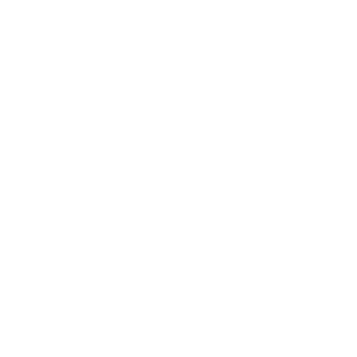
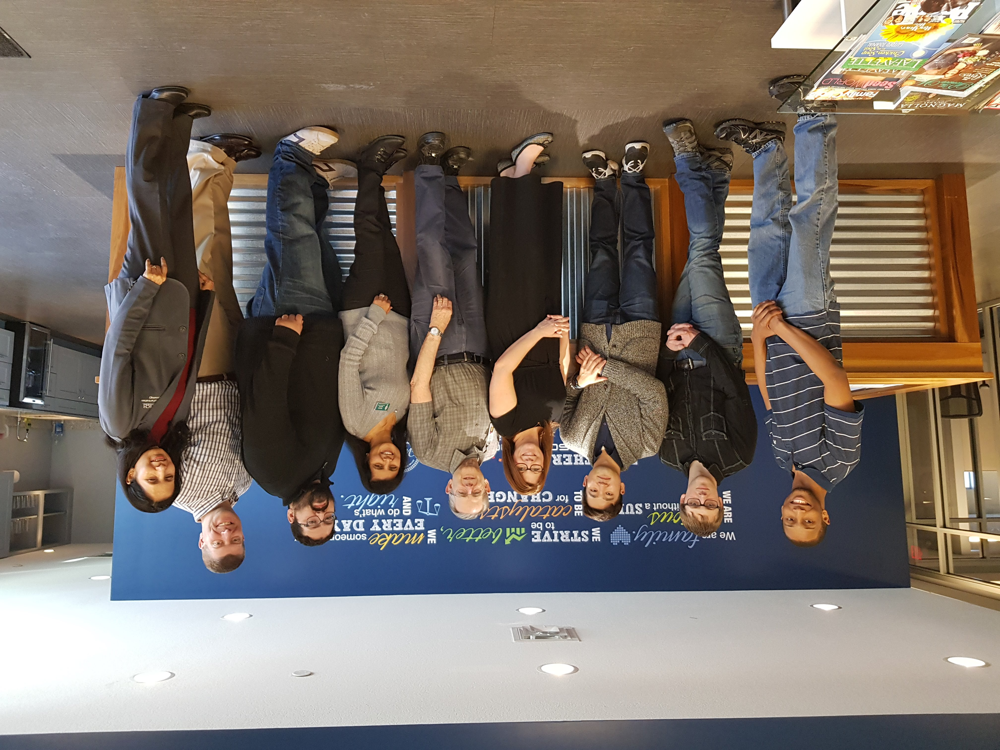
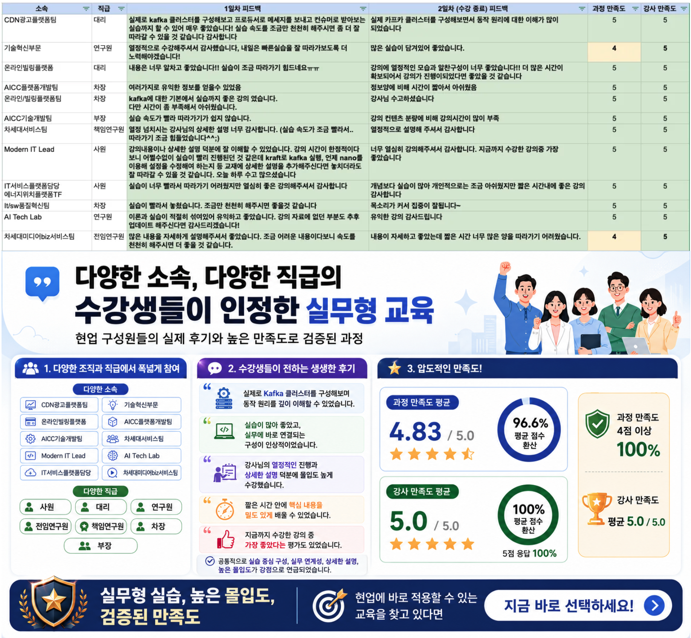
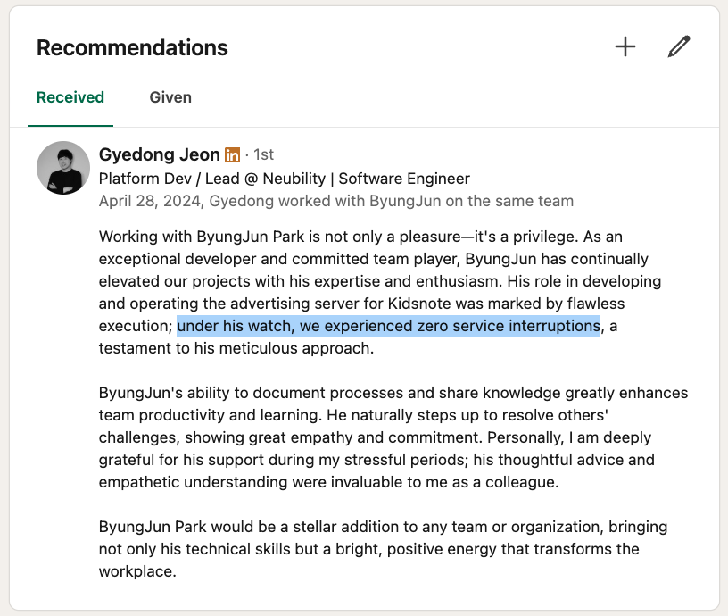

# DESIGN.md — Business Profile Design System

> 이 문서 한 장으로 새 페이지를 만들 수 있도록 구성된 **자기-완결적(self-contained)** 디자인 명세서다.
> 토큰 → 타이포 → 레이아웃 → 컴포넌트 → 인터랙션 → 반응형 → 접근성 순서로 읽고,
> 각 컴포넌트의 HTML 마크업과 CSS 정의를 그대로 복제해 동일한 외형을 재현한다.

---

## 1. 디자인 철학 (Why this looks like this)

### 1.1 한 문장 요약
> **고요한 흰 캔버스 위에 정량적 증거를 카드로, 정성적 경험을 다크 풀-블리드 밴드로 쌓아 올린, 단색 블루 액센트의 비즈니스 프로필.**

### 1.2 5가지 비타협 원칙 (Load-bearing rules)

1. **단일 액션 컬러.** 모든 인터랙티브 요소(링크·1차 CTA·타임라인 닷·아이콘 강조)는 한 가지 파랑 `#0066cc` 하나로 통일한다. 다크 면 위에서만 그보다 밝은 `#2997ff` 를 사용한다.
2. **표면 알터네이션이 곧 섹션 디바이더.** 라이트(`#ffffff`) ↔ 파치먼트(`#f5f5f7`) ↔ 다크(`#272729`) 세 톤을 번갈아 깔아 페이지 리듬을 만든다. 카드끼리 별도의 보더·그라데이션·구분선을 추가하지 않는다.
3. **본문 17px, 헤드라인 600.** 본문은 16px가 아닌 **17px / 400 / line-height 1.47**, 디스플레이는 항상 **weight 600** 에 음수 letter-spacing(-0.005em~-0.022em)을 적용한다. weight 500 은 시스템에서 비워 둔다.
4. **드롭 섀도는 단 1개.** 원형 프로필 사진에만 적용되는 `box-shadow: 3px 5px 30px rgba(0,0,0,0.22)`. 카드·버튼·이미지·텍스트에는 어떤 그림자도 더하지 않는다. 강조가 필요하면 표면 색을 바꾼다.
5. **사용자 입력에만 반응한다.** Hover 시 카드 elevate, 스크롤 페이드-인, 자동 회전 캐러셀, 패럴럭스 등 _자동 모션_ 은 금지. 액티브 시 `transform: scale(0.95)`, 차트 휠-리다이렉트, 모바일 sticky scroll-jacking 등 _직접 응답_ 모션만 허용한다.

### 1.3 페이지가 만들어내는 시각적 인상

| 인상 | 만들어내는 장치 |
|---|---|
| **고요함** | 그라데이션·드롭섀도·hover elevate 부재 |
| **신뢰감** | 1px hairline 카드, 17px 본문, 음수 letter-spacing |
| **정량적 증거 우선** | stat-card 의 48px 파란 수치, metric-callout의 34px 콜아웃, 시계열 막대 그래프 |
| **정성적 서사** | project-band 의 다크 풀-블리드 사진 + Mission Log 넘버링 |
| **현장감** | comparison-table 의 조밀한 강의/경력 표, parchment 칩으로 통일된 운영기관 라벨 |

---

## 2. Design Tokens — `:root` 단일 소스

다음 코드 블록은 모든 페이지에서 동일하게 선언되어야 한다. 컴포넌트 CSS는 이 토큰만 참조하고, **인라인 hex/임의 사이즈를 직접 박지 않는다**.

```css
:root {
    /* Surface — 배경/표면 */
    --canvas:                    #ffffff;             /* 라이트 타일·카드 기본 */
    --canvas-parchment:          #f5f5f7;             /* 교대 라이트 타일·푸터·칩 배경 */
    --surface-pearl:             #fafafc;             /* comparison-table row hover */
    --surface-tile-1:            #272729;             /* 다크 밴드 기본 */
    --surface-tile-2:            #2a2a2c;             /* 다크 밴드 tone-2 (한 단계 밝게) */
    --surface-tile-3:            #252527;             /* 다크 밴드 tone-3 (한 단계 어둡게) */
    --surface-black:             #000000;             /* 글로벌 nav, 모바일 drawer */
    --surface-chip-translucent:  rgba(210, 210, 215, 0.64);

    /* Ink & Text */
    --ink:                       #1d1d1f;             /* 라이트 면 본문/헤드라인 (순흑 대용) */
    --body:                      #1d1d1f;             /* ink와 동일 */
    --on-dark:                   #ffffff;             /* 다크 면 헤드라인 */
    --body-muted:                #cccccc;             /* 다크 면 보조 본문 */
    --ink-muted-80:              #333333;             /* 라이트 면 보조 본문, eyebrow */
    --ink-muted-48:              #7a7a7a;             /* 카피라이트, fine-print */

    /* Hairlines */
    --divider-soft:              rgba(0, 0, 0, 0.04);
    --hairline:                  #e0e0e0;             /* 라이트 면 1px 보더 전부 */
    --hairline-on-dark:          rgba(255, 255, 255, 0.16);

    /* Brand accent — 단일 블루 */
    --primary:                   #0066cc;             /* 라이트 면 인터랙티브 전부 */
    --primary-focus:             #0071e3;             /* 키보드 포커스 outline */
    --primary-on-dark:           #2997ff;             /* 다크 면 인터랙티브 전부 */

    /* Radius */
    --rounded-none:              0;
    --rounded-xs:                5px;
    --rounded-sm:                8px;
    --rounded-md:                11px;
    --rounded-lg:                18px;                /* 모든 메인 카드 */
    --rounded-pill:              9999px;              /* 1차 CTA, 모든 칩 */
    --rounded-full:              9999px;              /* 원형 (프로필 사진 50%, 아이콘 원) */

    /* Spacing — 4·8·12·17·24·32·48·80 */
    --space-xxs:                 4px;
    --space-xs:                  8px;
    --space-sm:                  12px;
    --space-md:                  17px;                /* 본문 1행 */
    --space-lg:                  24px;
    --space-xl:                  32px;
    --space-xxl:                 48px;
    --space-section:             80px;                /* 데스크톱 .tile 상하 패딩 */

    /* Shadow — 시스템 내 유일한 그림자 */
    --shadow-product:            0 10px 30px rgba(0, 0, 0, 0.22);
}
```

### 2.1 토큰 사용 매트릭스

| 토큰 | 사용처 |
|---|---|
| `--canvas` | tile-light 배경, 모든 카드 내부 |
| `--canvas-parchment` | tile-parchment 배경, footer 배경, 모든 칩 배경, comparison-table thead, parchment 인용박스 |
| `--surface-pearl` | comparison-table tbody tr:hover |
| `--surface-tile-1/2/3` | project-band 기본/tone-2/tone-3 |
| `--surface-black` | global-nav 배경, mobile-drawer 배경, evidence-zoom-hint pill |
| `--primary` | 링크 색, btn-pill-primary bg, btn-utility-blue bg, timeline 닷, info-card h3 i, icon-circle 글리프, stat-number 텍스트, linkedin-quote 보더, sub-line-link hover, 포커스 펄스 ring |
| `--primary-on-dark` | tile-dark/project-band 안의 모든 `<a>`, ad-revenue 차트 강조 막대, ad-revenue-eyebrow, ad-revenue-dot |
| `--ink` | 라이트 면 모든 헤드라인, btn-utility-dark bg, evidence-zoom-hint bg, evidence-summary 좌측 액센트 보더 |
| `--ink-muted-80` | tile-header p, contact-list li, sub-line, badge-issuer text, comparison-table td, evidence-summary 본문 |
| `--ink-muted-48` | footer-bottom 카피라이트, .name-roman |
| `--on-dark` | tile-dark/project-band 모든 본문 강조 텍스트 |
| `--body-muted` | tile-dark/project-band 본문 평문, project-num, ad-revenue-sub |
| `--hairline` | 모든 라이트 면 1px 보더 (info-card, highlight-card, stat-card, cohort-card, comparison-table, evidence-details, footer-bottom 위쪽) |
| `--hairline-on-dark` | project-body ul 상하 보더, specs-table, ad-revenue-block 외곽, mobile-drawer 링크 구분선 |
| `--shadow-product` | `.profile-photo` 단 1곳 |

---

## 3. Typography Ladder

### 3.1 폰트 스택 & 외부 자원 로딩

```html
<!-- <head> 안 -->
<link rel="preconnect" href="https://fonts.googleapis.com" />
<link rel="preconnect" href="https://fonts.gstatic.com" crossorigin />
<link href="https://fonts.googleapis.com/css2?family=Inter:wght@300;400;600;700&display=swap" rel="stylesheet" />
<link rel="stylesheet" as="style" crossorigin
      href="https://cdn.jsdelivr.net/gh/orioncactus/pretendard@v1.3.9/dist/web/variable/pretendardvariable-dynamic-subset.min.css" />
```

```css
body {
    margin: 0;
    font-family:
        -apple-system, BlinkMacSystemFont,
        "SF Pro Display", "SF Pro Text",
        "Inter", "Pretendard Variable", Pretendard,
        system-ui, "Noto Sans KR", sans-serif;
    background: var(--canvas);
    color: var(--ink);
    font-size: 17px;
    font-weight: 400;
    line-height: 1.47;
    letter-spacing: -0.022em;
    -webkit-font-smoothing: antialiased;
    text-rendering: optimizeLegibility;
}

::selection {
    background: rgba(0, 102, 204, 0.18);
    color: var(--ink);
}
```

- **macOS / iOS**에서는 SF Pro Display/Text 가 자동으로 잡힌다.
- **다른 OS 한글**은 Pretendard Variable, **영문**은 Inter 가 받친다.
- **본문은 17px**. 16px가 아니다. 추가 1px 가 "읽는 페이스"를 만든다.

### 3.2 사이즈 사다리 (Type Scale)

| 클래스 / 사용처 | size | weight | line-height | letter-spacing | 색상 | 용도 |
|---|---|---|---|---|---|---|
| `.hero h1` / `.t-hero-display` | 56px | 600 | 1.07 | -0.005em | `--ink` | Hero 인물 이름 |
| `.stat-card .stat-number` | 48px | 600 | 1.05 | -0.005em | **`--primary`** | 빅 수치 (시스템 내 _유일한_ 컬러 헤드라인 예외) |
| `.tile-header h2` · `.contact-cta-wrap h2` · `.project-title` · `.t-display-lg` · `.t-h1` | 40px | 600 | 1.1 | -0.005em | `--ink` (다크 면은 `--on-dark`) | 모든 섹션 타이틀 |
| `.t-display-md` · `.metric-callout .metric-value` · `.t-h2` | 34px | 600 | 1.15~1.2 | -0.011em | `--ink` / `--on-dark` | 메트릭 콜아웃 |
| `.ad-revenue-title` | 22px | 600 | 1.2 | -0.011em | `--on-dark` | 차트 카드 타이틀 |
| `.hero .tagline` · `.info-card h3` · `.highlight-card h3` · `.cohort-header h3` · `.t-tagline` | 21px | 400~600 | 1.19~1.42 | +0.011em | `--ink` | H3, 히어로 태그라인 |
| `.t-lead` · `.contact-cta-wrap p` | 24px / 21px | 400 | 1.33~1.38 | +0.009em | `--ink-muted-80` | Lead paragraph |
| `body` · `.t-body` · `.t-body-strong` · `.tile-header p` · `.timeline .title` · `.highlight-card .lead-line` · `.stat-card .stat-label` · `.btn-pill-*` · `.project-body p/li` | 17px | 400 / 600 | 1.47 | -0.022em | `--ink` / `--body-muted` | **본문 디폴트** |
| `.t-caption` · `.btn-utility-*` · `.contact-list li` · `.timeline .period/.desc` · `.sub-line` · `.stat-card .stat-sub` · `.comparison-table td` · `.specs-table td` · `.evidence-summary` · `.linkedin-quote` | 14px | 400~600 | 1.43~1.55 | -0.016em | `--ink-muted-80` / `--body-muted` | 보조 본문·캡션 |
| `.stack-chip` · `.badge-notion` · `.cohort-meta .badge` · `.timeline .badge-issuer` · `.footer-link` · `.t-fine-print` · `.modal-caption` | 12px | 400 | 1~1.5 | -0.01em | `--ink-muted-80` / muted | 칩·라벨·footer |
| `.t-micro-cap` · `.tile-header .eyebrow` · `.comparison-table th` · `.specs-table th` · `.project-num` · `.project-org` · `.metric-callout .metric-label` · `.ad-revenue-eyebrow` | 11~14px | 600 | 1 | +0.04~0.08em **UPPERCASE** | various | 모든 마이크로-캡 라벨 |
| `.linkedin-quote-cite` | 12.5px | 600 | — | +0.02em | `--primary` | 인용 출처 |
| `.global-nav .nav-link-item` | 12px | 400 | 1 | -0.01em | `--on-dark` opacity 0.85 | 글로벌 nav 링크 |

### 3.3 타이포 유틸리티 클래스 정의

```css
.t-hero-display    { font-size: 56px; font-weight: 600; line-height: 1.07; letter-spacing: -0.005em; }
.t-display-lg      { font-size: 40px; font-weight: 600; line-height: 1.10; letter-spacing: -0.005em; }
.t-display-md      { font-size: 34px; font-weight: 600; line-height: 1.20; letter-spacing: -0.011em; }
.t-lead            { font-size: 24px; font-weight: 400; line-height: 1.33; letter-spacing:  0.009em; }
.t-tagline         { font-size: 21px; font-weight: 600; line-height: 1.19; letter-spacing:  0.011em; }
.t-body-strong     { font-size: 17px; font-weight: 600; line-height: 1.24; letter-spacing: -0.022em; }
.t-body            { font-size: 17px; font-weight: 400; line-height: 1.47; letter-spacing: -0.022em; }
.t-caption         { font-size: 14px; font-weight: 400; line-height: 1.43; letter-spacing: -0.016em; }
.t-caption-strong  { font-size: 14px; font-weight: 600; line-height: 1.29; letter-spacing: -0.016em; }
.t-fine-print      { font-size: 12px; font-weight: 400; line-height: 1.50; letter-spacing: -0.010em; }
.t-micro-cap       { font-size: 12px; font-weight: 600; line-height: 1; letter-spacing: 0.04em;
                     text-transform: uppercase; }

/* 한글 친화 디스플레이 (대문자/조판폭 변환을 피한다) */
.t-display-xl      { font-family: inherit; font-size: 40px; font-weight: 600;
                     line-height: 1.1; letter-spacing: -0.005em; text-transform: none; }
@media (max-width: 734px) { .t-display-xl { font-size: 34px; } }
```

### 3.4 디스플레이 사이즈 반응형 다운스텝

| 베이스 (≥1024px) | ≤1024px | ≤833px | ≤734px | ≤640px |
|---|---|---|---|---|
| `.hero h1` 56 | 48 | 40 | — | 34 |
| `.tile-header h2` · `.contact-cta-wrap h2` 40 | — | — | 32 | — |
| `.t-h2` 34 | — | — | 28 | — |
| `.project-title` 40 | — | — | 30 | — |
| `.metric-callout .metric-value` 34 | — | — | 26 | — |
| `.hero .tagline` 21 | — | — | — | 17 |
| `.contact-cta-wrap p` 21 | — | — | 17 | — |
| `.ad-revenue-title` 22 | — | — | 19 | — |

### 3.5 타이포 색·웨이트 사용 룰

- **헤드라인은 단색 `--ink`** (다크 면에서는 `--on-dark`). **단 한 가지 예외**가 `.stat-card .stat-number` 로, 여기서는 `--primary` 파란색으로 칠해 정량적 수치를 도드라지게 한다.
- **강조용 `<strong>` 은 항상 weight 600**. 본문(400) 과 강조(600) 의 두 단계만 사용. weight 500 은 시스템에서 의도적으로 비워 둔다.
- **음수 letter-spacing 은 17px 이상부터.** 12px 이하 마이크로 라벨은 +0.04~0.08em 의 _양수_ 트래킹을 적용해 대문자 라벨 사이에 공기를 만든다.

---

## 4. Global Layout System

### 4.1 페이지 골격

```html
<!DOCTYPE html>
<html lang="ko">
<head>
    <meta charset="UTF-8" />
    <meta name="viewport" content="width=device-width, initial-scale=1.0" />
    <title>...</title>
    <link rel="icon" type="image/png" href="assets/favicon.png" />
    <!-- Bootstrap 5 (grid + modal + collapse 용) -->
    <link href="https://cdn.jsdelivr.net/npm/bootstrap@5.3.3/dist/css/bootstrap.min.css" rel="stylesheet" />
    <link rel="stylesheet" href="https://cdn.jsdelivr.net/npm/bootstrap-icons@1.11.3/font/bootstrap-icons.css" />
    <!-- 폰트 (§3.1) -->
    <!-- 자체 스타일시트 -->
    <link rel="stylesheet" href="styles.css" />
</head>
<body>
    <nav class="global-nav">...</nav>
    <div class="mobile-drawer">...</div>

    <header id="top" class="hero tile-light">...</header>

    <section id="…" class="tile tile-parchment">...</section>
    <section id="…" class="tile tile-light">...</section>
    <!-- ... -->
    <section id="projects" class="tile tile-dark">
        <div class="tile-header">…</div>
    </section>
    <section class="project-band tone-2">...</section>
    <section class="project-band">...</section>
    <section class="project-band tone-3">...</section>
    <!-- ... -->
    <section class="tile tile-light"><!-- Contact CTA --></section>

    <footer class="footer-region">...</footer>

    <!-- Lightbox modal (전역 단일) -->
    <div class="modal fade" id="evidenceModal">...</div>

    <script src="https://cdn.jsdelivr.net/npm/bootstrap@5.3.3/dist/js/bootstrap.bundle.min.js"></script>
    <script src="https://cdn.jsdelivr.net/npm/chart.js@4.4.4/dist/chart.umd.min.js"></script>
    <script>/* 페이지 스크립트: §11~13 */</script>
</body>
</html>
```

### 4.2 Base 리셋 & 글로벌 룰

```css
* { box-sizing: border-box; }

html {
    scroll-behavior: smooth;
    background: var(--canvas);
}

a { color: var(--primary); text-decoration: none; }
a:hover { text-decoration: underline; }

img { max-width: 100%; display: block; }

/* sticky nav 44px + 12px 여유를 고려한 스크롤 점프 보정 */
section[id], header[id] { scroll-margin-top: 56px; }

section, header, footer { padding: 0; }
```

### 4.3 Tile / 표면 시스템

페이지는 **풀-블리드 타일** 5종을 알터네이션하며 쌓는다. 타일 사이에 명시적 디바이더(보더·그라데이션)는 두지 않는다. **색 변화 자체가 디바이더**다.

```css
.tile {
    width: 100%;
    padding: 80px 0;
    position: relative;
}
@media (max-width: 734px) {
    .tile { padding: 48px 0; }
}

.tile-light      { background: var(--canvas);            color: var(--ink); }
.tile-parchment  { background: var(--canvas-parchment);  color: var(--ink); }
.tile-dark       { background: var(--surface-tile-1);    color: var(--on-dark); }
.tile-dark-2     { background: var(--surface-tile-2);    color: var(--on-dark); }
.tile-dark-3     { background: var(--surface-tile-3);    color: var(--on-dark); }

/* 다크 타일 위의 inline 링크는 자동으로 밝은 블루로 */
.tile-dark a, .tile-dark-2 a, .tile-dark-3 a,
.project-band a { color: var(--primary-on-dark); }
```

#### 표면 알터네이션 표준 시퀀스

```
[#000 Global Nav 44px sticky]
   ↓
Hero               → tile-light
About              → tile-parchment
Strengths          → tile-light
Track Record       → tile-parchment
Teaching           → tile-light
Career             → tile-parchment
Projects intro     → tile-dark   (다크 진입 선언)
Project bands × N  → 다크 톤 1/2/3 교차
Contact CTA        → tile-light  (라이트 복귀)
Footer             → parchment
```

규칙:
- 연속 두 light 또는 연속 두 parchment 는 금지.
- 다크 영역 진입은 반드시 `tile-dark` (Projects intro) 한 장으로 시작.
- 다크 영역 종료는 반드시 `tile-light` (Contact CTA) 로 복귀.

### 4.4 컨테이너 폭

```css
/* 텍스트가 빽빽한 헤더 블록 (eyebrow + h2 + sub copy) */
.tile-container       { max-width:  980px; margin: 0 auto; padding: 0 22px; }

/* 표·차트 같이 넓이가 필요한 영역 */
.tile-container-wide  { max-width: 1200px; margin: 0 auto; padding: 0 22px; }

/* Bootstrap container 를 1100px 로 강제 다운사이즈 (전체 페이지 일관성) */
.container {
    max-width:    1100px  !important;
    padding-left:   22px  !important;
    padding-right:  22px  !important;
}

/* 섹션 타이틀 블록 */
.tile-header {
    text-align: center;
    max-width: 720px;
    margin: 0 auto 64px;
    padding: 0 22px;
}
@media (max-width: 734px) { .tile-header { margin-bottom: 40px; } }

.tile-header.left {
    text-align: left;
    margin-left: 22px;
    margin-right: auto;
}
```

| 컨테이너 | max-width | 용도 |
|---|---|---|
| `.global-nav-inner` · `.hero-grid` · `.project-content` · `.comparison-table` · `.footer-grid` | 1100px | 페이지 전반 표준 폭 |
| `.tile-container-wide` | 1200px | 강의·경력 표 등 넓은 표 |
| `.container` (Bootstrap) | **1100px** (강제) | About / Strengths / KDT 카드 그리드 |
| `.tile-container` | 980px | 텍스트 헤비 블록 |
| `.tile-header` · `.contact-cta-wrap` | 720px | 섹션 헤더 / Contact CTA 텍스트 블록 |

### 4.5 표준 섹션 헤더

```html
<section id="strengths" class="tile tile-light">
    <div class="tile-header">
        <span class="eyebrow">Core Strengths</span>
        <h2>차별화된 3가지 핵심 역량</h2>
        <p>뉴스 속도의 최신 교육, 100% 수료의 학습자 맞춤 교육, 장애율 0%의 엔지니어링.</p>
    </div>
    <div class="container">
        <!-- 콘텐츠 -->
    </div>
</section>
```

```css
.tile-header .eyebrow {
    display: block;
    font-size: 14px;
    font-weight: 600;
    color: var(--ink-muted-80);
    letter-spacing: 0;
    margin-bottom: 12px;
}
.tile-dark .tile-header .eyebrow,
.tile-dark-2 .tile-header .eyebrow,
.tile-dark-3 .tile-header .eyebrow { color: var(--body-muted); }

.tile-header h2 {
    font-size: 40px;
    font-weight: 600;
    line-height: 1.1;
    letter-spacing: -0.005em;
    margin: 0 0 12px;
    color: inherit;
}
@media (max-width: 734px) { .tile-header h2 { font-size: 32px; } }

.tile-header p {
    font-size: 17px;
    line-height: 1.47;
    letter-spacing: -0.022em;
    color: var(--ink-muted-80);
    margin: 0;
}
.tile-dark .tile-header p,
.tile-dark-2 .tile-header p,
.tile-dark-3 .tile-header p { color: var(--body-muted); }
```

**Eyebrow 텍스트는 항상 영문 짧은 라벨** (예: `About`, `Core Strengths`, `Track Record`, `Teaching`, `Career`, `Mission Log`). 한글 섹션 타이틀은 `<h2>` 가 받는다.

### 4.6 인페이지 점프 타깃 펄스

해시 링크로 카드에 착지할 때 1.6초간 블루 ring 으로 펄스해 시각적 안내를 준다.

```css
:target.info-card,
:target.highlight-card,
:target.project-band {
    animation: targetPulse 1.6s ease-out;
}
@keyframes targetPulse {
    0%   { box-shadow: 0 0 0 0   rgba(0, 102, 204, 0.45); }
    70%  { box-shadow: 0 0 0 12px rgba(0, 102, 204, 0);    }
    100% { box-shadow: 0 0 0 0   rgba(0, 102, 204, 0);    }
}
```

타깃이 될 카드/섹션에는 `id` 를 부여하고, 동일 페이지 내 다른 곳에서 `<a href="#…">` 로 점프시킨다.

---

## 5. Global Navigation (sticky 44px black bar)

### 5.1 HTML

```html
<nav class="global-nav">
    <div class="global-nav-inner">
        <a class="nav-brand" href="#top">
            
            <span>박병준 · AI &amp; IT 컨설턴트</span>
        </a>
        <div class="nav-links">
            <a class="nav-link-item" href="#about">소개</a>
            <a class="nav-link-item" href="#strengths">핵심 역량</a>
            <a class="nav-link-item" href="#kdt-graduation">KDT 수료</a>
            <a class="nav-link-item" href="#teaching">강의</a>
            <a class="nav-link-item" href="#career">경력</a>
            <a class="nav-link-item" href="#projects">프로젝트</a>
        </div>
        <div class="nav-actions">
            <a class="btn-utility-dark" href="mailto:...">
                <i class="bi bi-envelope"></i>
                Contact
            </a>
            <a class="btn-utility-blue" href="https://www.linkedin.com/in/..." target="_blank" rel="noopener">
                LinkedIn
            </a>
            <button class="nav-mobile-toggle" type="button" id="mobileToggle" aria-label="메뉴 열기">
                <i class="bi bi-list"></i>
            </button>
        </div>
    </div>
</nav>

<!-- 모바일 풀스크린 드로어 -->
<div class="mobile-drawer" id="mobileDrawer">
    <a href="#about">소개</a>
    <a href="#strengths">핵심 역량</a>
    <!-- ... 동일 링크들 ... -->
    <a href="mailto:...">Contact</a>
    <a href="https://www.linkedin.com/in/..." target="_blank" rel="noopener">LinkedIn</a>
</div>
```

### 5.2 CSS

```css
.global-nav {
    background: var(--surface-black);
    color: var(--on-dark);
    position: sticky;
    top: 0;
    z-index: 1000;
    height: 44px;
}
.global-nav-inner {
    display: flex;
    align-items: center;
    justify-content: space-between;
    height: 44px;
    max-width: 1100px;
    margin: 0 auto;
    padding: 0 22px;
}
.global-nav .nav-brand {
    font-size: 14px;
    font-weight: 600;
    color: var(--on-dark);
    text-decoration: none;
    letter-spacing: -0.016em;
    display: inline-flex;
    align-items: center;
    gap: 8px;
}
.global-nav .nav-brand-icon {
    width: 24px; height: 24px;
    object-fit: contain;
    flex: 0 0 auto;
}
.global-nav .nav-brand:hover { text-decoration: none; }

.global-nav .nav-links { display: flex; align-items: center; gap: 4px; }
.global-nav .nav-link-item {
    color: var(--on-dark);
    opacity: 0.85;
    font-size: 12px;
    font-weight: 400;
    line-height: 1;
    letter-spacing: -0.01em;
    text-decoration: none;
    padding: 8px 14px;
}
.global-nav .nav-link-item:hover { opacity: 1; text-decoration: none; }

.global-nav .nav-actions { display: flex; align-items: center; gap: 8px; }
.global-nav .nav-mobile-toggle {
    display: none;
    background: transparent;
    border: 0;
    color: var(--on-dark);
    cursor: pointer;
    padding: 6px 10px;
    font-size: 16px;
}

@media (max-width: 833px) {
    .global-nav .nav-links { display: none; }
    .global-nav .nav-mobile-toggle { display: inline-flex; }
    .global-nav .nav-actions .btn-utility-dark,
    .global-nav .nav-actions .btn-utility-blue { display: none; }
}

/* 모바일 드로어 */
.mobile-drawer {
    display: none;
    position: fixed;
    top: 44px; left: 0; right: 0; bottom: 0;
    background: var(--surface-black);
    z-index: 999;
    padding: 16px 22px;
    overflow-y: auto;
}
.mobile-drawer.open { display: block; }
.mobile-drawer a {
    display: block;
    padding: 14px 0;
    color: var(--on-dark);
    font-size: 17px;
    font-weight: 400;
    text-decoration: none;
    letter-spacing: -0.022em;
    border-bottom: 1px solid var(--hairline-on-dark);
}
.mobile-drawer a:last-child { border-bottom: none; }
```

### 5.3 모바일 드로어 토글 JS

```js
(function () {
    const toggle = document.getElementById("mobileToggle");
    const drawer = document.getElementById("mobileDrawer");
    if (!toggle || !drawer) return;
    toggle.addEventListener("click", function () {
        drawer.classList.toggle("open");
    });
    drawer.querySelectorAll("a").forEach(function (a) {
        a.addEventListener("click", function () {
            drawer.classList.remove("open");
        });
    });
})();
```

---

## 6. Button Vocabulary (4종)

시스템은 **4종류의 버튼만** 사용한다. 신규 버튼을 추가하지 않는다.

### 6.1 `.btn-pill-primary` — 1차 CTA

```html
<a class="btn-pill-primary" href="mailto:...">
    이메일로 의뢰하기
    <i class="bi bi-arrow-right"></i>
</a>
```

```css
.btn-pill-primary {
    display: inline-flex;
    align-items: center;
    justify-content: center;
    gap: 6px;
    background: var(--primary);
    color: var(--on-dark);
    border: 0;
    border-radius: var(--rounded-pill);
    font-size: 17px;
    font-weight: 400;
    line-height: 1;
    letter-spacing: -0.022em;
    padding: 12px 22px;
    text-decoration: none;
    cursor: pointer;
    transition: transform 150ms ease;
}
.btn-pill-primary:hover  { color: var(--on-dark); text-decoration: none; }
.btn-pill-primary:active { transform: scale(0.95); }
.btn-pill-primary:focus-visible {
    outline: 2px solid var(--primary-focus);
    outline-offset: 2px;
}
```

### 6.2 `.btn-pill-secondary` — 2차 CTA

```html
<a class="btn-pill-secondary" href="https://www.linkedin.com/in/..." target="_blank" rel="noopener">
    LinkedIn 프로필
</a>
```

```css
.btn-pill-secondary {
    display: inline-flex; align-items: center; justify-content: center;
    gap: 6px;
    background: transparent;
    color: var(--primary);
    border: 1px solid var(--primary);
    border-radius: var(--rounded-pill);
    font-size: 17px;
    font-weight: 400;
    line-height: 1;
    letter-spacing: -0.022em;
    padding: 11px 22px;
    text-decoration: none;
    cursor: pointer;
    transition: transform 150ms ease;
}
.btn-pill-secondary:hover  { color: var(--primary); text-decoration: none; }
.btn-pill-secondary:active { transform: scale(0.95); }
```

### 6.3 `.btn-utility-dark` — 마이크로 다크 버튼 (nav)

```html
<a class="btn-utility-dark" href="mailto:...">
    <i class="bi bi-envelope"></i>
    Contact
</a>
```

```css
.btn-utility-dark {
    display: inline-flex; align-items: center; gap: 6px;
    background: var(--ink);
    color: var(--on-dark);
    border: 0;
    border-radius: var(--rounded-sm);
    font-size: 14px;
    font-weight: 400;
    line-height: 1;
    letter-spacing: -0.016em;
    padding: 8px 15px;
    text-decoration: none;
    cursor: pointer;
}
.btn-utility-dark:hover  { color: var(--on-dark); text-decoration: none; }
.btn-utility-dark:active { transform: scale(0.95); }
```

### 6.4 `.btn-utility-blue` — 마이크로 블루 버튼 (nav)

```html
<a class="btn-utility-blue" href="https://www.linkedin.com/in/..." target="_blank" rel="noopener">
    LinkedIn
</a>
```

```css
.btn-utility-blue {
    display: inline-flex; align-items: center; gap: 6px;
    background: var(--primary);
    color: var(--on-dark);
    border: 0;
    border-radius: var(--rounded-sm);
    font-size: 14px;
    font-weight: 400;
    line-height: 1;
    letter-spacing: -0.016em;
    padding: 8px 15px;
    text-decoration: none;
    cursor: pointer;
}
.btn-utility-blue:hover  { color: var(--on-dark); text-decoration: none; }
.btn-utility-blue:active { transform: scale(0.95); }
```

### 6.5 버튼 요약 표

| 버튼 | 형태 | bg | text | size | radius | padding | 사용처 |
|---|---|---|---|---|---|---|---|
| `.btn-pill-primary` | pill | `--primary` | `--on-dark` | 17/400 | `--rounded-pill` | 12·22 | Contact CTA 1차 |
| `.btn-pill-secondary` | pill 1px outline | transparent | `--primary` | 17/400 | `--rounded-pill` | 11·22 | Contact CTA 2차 |
| `.btn-utility-dark` | 8px rect | `--ink` | `--on-dark` | 14/400 | `--rounded-sm` | 8·15 | Nav Contact |
| `.btn-utility-blue` | 8px rect | `--primary` | `--on-dark` | 14/400 | `--rounded-sm` | 8·15 | Nav LinkedIn |

공통: `transition: transform 150ms ease`, `:active { transform: scale(0.95); }`.

---

## 7. Hero — 인물/타이틀 소개

페이지 최상단의 인물 카드. **유일하게 `--shadow-product` 가 적용되는 영역** (원형 프로필 사진).

### 7.1 HTML

```html
<header id="top" class="hero tile-light">
    <div class="hero-grid">
        <div>
            
        </div>
        <div>
            <span class="hero-eyebrow">AI &amp; IT Consultant</span>
            <h1>박병준<span class="name-roman">Park Byungjun</span></h1>
            <p class="tagline">
                <span class="tagline-line">
                    AI · 빅데이터 · 클라우드 생태계를 <strong>뉴스 속도로</strong>
                    교육과 엔지니어링에 적용합니다.
                </span>
                <span class="tagline-line tagline-subline">
                    KDT 장기과정 <strong>2기수 연속 100% 수료, 만족도 100% 추천</strong>
                </span>
            </p>
            <ul class="contact-list">
                <li><i class="bi bi-linkedin"></i><a href="...">linkedin.com/in/...</a></li>
                <li><i class="bi bi-github"></i><a href="...">github.com/...</a></li>
            </ul>
            <ul class="contact-list" style="margin-top: 10px;">
                <li><i class="bi bi-envelope-fill"></i><a href="mailto:...">...@gmail.com</a></li>
                <li><i class="bi bi-chat-fill"></i><a href="...">Kakao · ...</a></li>
            </ul>
        </div>
    </div>
</header>
```

### 7.2 CSS

```css
.hero {
    background: var(--canvas);
    color: var(--ink);
    padding: 80px 0 80px;
}
@media (max-width: 734px) { .hero { padding: 48px 0; } }

.hero-grid {
    display: grid;
    grid-template-columns: minmax(180px, 280px) 1fr;
    gap: 64px;
    align-items: center;
    max-width: 1100px;
    margin: 0 auto;
    padding: 0 22px;
}
@media (max-width: 833px) {
    .hero-grid {
        grid-template-columns: 1fr;
        gap: 32px;
        text-align: center;
        justify-items: center;
    }
}

.profile-photo {
    width: 100%;
    max-width: 280px;
    aspect-ratio: 1 / 1;
    object-fit: cover;
    border-radius: 50%;
    border: 0;
    box-shadow: 3px 5px 30px rgba(0, 0, 0, 0.22);   /* 시스템 내 유일한 그림자 */
}

.hero-eyebrow {
    display: block;
    font-size: 14px;
    font-weight: 600;
    color: var(--ink-muted-80);
    letter-spacing: 0;
    margin-bottom: 14px;
}

.hero h1 {
    font-size: 56px;
    font-weight: 600;
    line-height: 1.07;
    letter-spacing: -0.005em;
    color: var(--ink);
    margin: 0 0 20px;
}
@media (max-width: 1024px) { .hero h1 { font-size: 48px; } }
@media (max-width: 833px)  { .hero h1 { font-size: 40px; } }
@media (max-width: 640px)  { .hero h1 { font-size: 34px; } }

.hero h1 .name-roman {
    display: inline-block;
    font-size: 0.45em;
    font-weight: 400;
    color: var(--ink-muted-48);
    margin-left: 8px;
    letter-spacing: -0.005em;
}
@media (max-width: 833px) {
    .hero h1 .name-roman { display: block; margin-left: 0; margin-top: 6px; }
}

.hero .tagline {
    font-size: 21px;
    font-weight: 400;
    line-height: 1.42;
    letter-spacing: 0.011em;
    color: var(--ink-muted-80);
    margin: 0 0 28px;
}
.hero .tagline strong { font-weight: 600; color: var(--ink); }
.hero .tagline-line { display: block; }
.hero .tagline-subline,
.hero .tagline-subline strong { color: #999999; }
.hero .tagline-line + .tagline-line { margin-top: 4px; }
@media (max-width: 640px) { .hero .tagline { font-size: 17px; } }
```

### 7.3 컨택트 리스트

```css
.contact-list {
    list-style: none;
    padding: 0; margin: 0;
    display: flex;
    flex-wrap: wrap;
    gap: 18px 24px;
}
@media (max-width: 833px) { .contact-list { justify-content: center; } }

.contact-list li {
    display: inline-flex;
    align-items: center;
    gap: 8px;
    font-size: 14px;
    color: var(--ink-muted-80);
    letter-spacing: -0.016em;
}
.contact-list li i      { font-size: 14px; color: var(--ink-muted-80); }
.contact-list a         { color: var(--ink-muted-80); text-decoration: none; }
.contact-list a:hover   { color: var(--primary);     text-decoration: none; }
```

### 7.4 Hero 콘텐츠 시맨틱

| 영역 | 의미 | 시각 |
|---|---|---|
| `.profile-photo` | 인물 시각 식별자 | 원형(50%), 280px, product-shadow |
| `.hero-eyebrow` | 역할/직함 라벨 (영문) | 14px / 600 / muted |
| `.hero h1` | 인물 이름 (한글) + `.name-roman` (영문 0.45em / 400 / muted-48) | 56px / 600 / -0.005em |
| `.tagline-line` (1줄) | 핵심 가치 제안. `<strong>` 으로 핵심 키워드 강조 (ink 단색) | 21px / 400, strong 600 |
| `.tagline-subline` (2줄) | 보조 근거/실적. 전체 텍스트 `#999999` 로 한 단계 가라앉힌다 | 21px / 400 / `#999` |
| `.contact-list` × 2줄 | 4개의 contact 채널 (LinkedIn / GitHub / Email / Kakao). bootstrap-icons 좌측 글리프 + 인라인 링크 | 14px / muted, hover 시 `--primary` |

---

## 8. 콘텐츠 유형 → 컴포넌트 매핑 (의사결정 표)

새 페이지에서 좌측의 _콘텐츠 유형_ 을 식별해, 우측의 _컴포넌트_ 를 그대로 사용한다.

| 콘텐츠 유형 | 컴포넌트 | 표면 | 섹션 § |
|---|---|---|---|
| 인물/타이틀 소개 | Hero | tile-light | §7 |
| 학력·자격 등 **날짜 + 제목 + 설명** 시리즈 | Info Card with Timeline | parchment | §9 |
| **N가지 핵심 역량/포지셔닝** | Highlight Card (3-up) | light | §10 |
| 빅 수치 통계 (퍼센트/카운트) | Stat Card (3-up) | parchment | §11 |
| 기수/회차별 트랙 레코드 + 증빙 이미지 | Cohort Card + Evidence Details | parchment | §12 |
| 강의·경력 등 **시계열 표 데이터** | Comparison Table | light/parchment | §13 |
| 다크 풀-블리드 **프로젝트 1건** | Project Band | dark (tile-1/2/3 교차) | §14 |
| 프로젝트 안의 일정/구성표 | Specs Table | dark | §14.5 |
| 프로젝트 안의 **큰 수치 콜아웃** | Metric Callout | dark | §14.6 |
| 프로젝트 안의 단일 사진 | Project Image | dark | §14.7 |
| 프로젝트 안의 사진 갤러리 (N장) | Project Gallery | dark | §14.7 |
| 시계열 정량 데이터 (월별 매출 등) | Ad-Revenue 차트 패턴 | dark | §17 |
| 레퍼런스 이미지 (만족도 그래프 등) | Info Card + Evidence Image (`.is-natural`) + Evidence Summary | light | §15 |
| 인용/추천사 | Info Card + LinkedIn Quote | light | §15 |
| 의뢰/문의 CTA | Contact CTA | light | §18 |
| 사이트맵/외부 링크 | Footer | parchment | §19 |

---

## 9. Info Card with Timeline

**날짜 + 제목 + 설명** 의 시리즈 데이터(학력·자격증 등)를 표현하는 카드.

### 9.1 HTML

```html
<section id="about" class="tile tile-parchment">
    <div class="tile-header">
        <span class="eyebrow">About</span>
        <h2>교육 사항 &amp; 자격</h2>
        <p>학문적 배경과 클라우드 · 데이터 분야 공인 자격으로 다져진 기술 인프라.</p>
    </div>
    <div class="container">
        <div class="row g-4">
            <div class="col-lg-6">
                <div class="info-card">
                    <h3><i class="bi bi-mortarboard-fill"></i>교육 사항</h3>
                    <ul class="timeline">
                        <li>
                            <span class="period">2025.08</span>
                            <span class="title">AI 빅데이터 MS &amp; MBA</span>
                            <span class="desc">aSSIST · SDG MS (Switzerland, Geneva)</span>
                        </li>
                        <!-- ... 추가 항목 ... -->
                    </ul>
                </div>
            </div>
            <div class="col-lg-6">
                <div class="info-card">
                    <h3><i class="bi bi-patch-check-fill"></i>자격 사항</h3>
                    <ul class="timeline">
                        <li>
                            <span class="period">2024.06</span>
                            <span class="title">AWS Certified Solutions Architect Associate</span>
                            <span class="badge-issuer">Amazon Web Services</span>
                        </li>
                        <!-- ... 추가 항목 ... -->
                    </ul>
                </div>
            </div>
        </div>
    </div>
</section>
```

### 9.2 CSS

```css
.info-card {
    background: var(--canvas);
    border: 1px solid var(--hairline);
    border-radius: var(--rounded-lg);
    padding: 32px;
    height: 100%;
    box-shadow: none;
}
.info-card:hover { transform: none; box-shadow: none; }    /* hover elevate 금지 */

.info-card h3 {
    font-size: 21px;
    font-weight: 600;
    line-height: 1.19;
    letter-spacing: 0.011em;
    margin: 0 0 24px;
    color: var(--ink);
    display: flex;
    align-items: center;
    gap: 10px;
}
.info-card h3 i { color: var(--primary); font-size: 22px; }

.timeline { list-style: none; padding: 0; margin: 0; }
.timeline li {
    position: relative;
    padding-left: 24px;
    padding-bottom: 24px;
    border-left: 1px solid var(--hairline);
    margin-left: 4px;
}
.timeline li:last-child { padding-bottom: 0; }
.timeline li::before {
    content: "";
    position: absolute;
    left: -5px; top: 4px;
    width: 9px; height: 9px;
    border-radius: 50%;
    background: var(--primary);
}
.timeline .period {
    display: block;
    font-size: 14px;
    font-weight: 600;
    color: var(--primary);
    margin-bottom: 4px;
    letter-spacing: -0.016em;
}
.timeline .title {
    display: block;
    font-size: 17px;
    font-weight: 600;
    color: var(--ink);
    letter-spacing: -0.022em;
}
.timeline .desc {
    display: block;
    font-size: 14px;
    color: var(--ink-muted-80);
    letter-spacing: -0.016em;
    margin-top: 2px;
}
.timeline .badge-issuer {
    display: inline-block;
    background: var(--canvas-parchment);
    color: var(--ink-muted-80);
    padding: 2px 8px;
    border-radius: var(--rounded-xs);   /* 5px — 유일하게 사각 칩 */
    font-size: 12px;
    font-weight: 400;
    letter-spacing: -0.01em;
    margin-left: 6px;
}
```

### 9.3 시맨틱 룰

- **`.period`** 는 항상 `YYYY.MM` 포맷의 한 줄 영문/숫자 라벨. 파란색으로 칠해 시각적 진입점이 된다.
- **`.title`** 은 본문 17px 굵게. 한글/영문 모두 허용.
- **`.desc`** 는 짧은 설명 한 줄 (소속·내용). 자격 사항 카드에서는 `.desc` 대신 `.badge-issuer` 칩으로 발급기관을 표시한다.
- 좌측 1px 레일 + 9px 닷은 콘텐츠 깊이가 아니라 _시간 흐름_ 을 시각화한다. 즉 최신이 위.

---

## 10. Highlight Card (N가지 핵심 역량)

3개의 카드를 1행에 깔아 _포지셔닝_ 을 명시한다. 각 카드는 _아이콘 원 + H3 + 불릿 리스트_ 의 세 부분으로 구성된다.

### 10.1 HTML

```html
<section id="strengths" class="tile tile-light">
    <div class="tile-header">
        <span class="eyebrow">Core Strengths</span>
        <h2>차별화된 3가지 핵심 역량</h2>
        <p>뉴스 속도의 최신 교육, 100% 수료의 학습자 맞춤 교육, 장애율 0%의 엔지니어링.</p>
    </div>
    <div class="container">
        <div class="row g-4">
            <div class="col-lg-4">
                <div class="highlight-card">
                    <div class="icon-circle"><i class="bi bi-newspaper"></i></div>
                    <h3>급변하는 기술 생태계를 뉴스 속도로 업데이트하는 교육</h3>
                    <ul>
                        <li>
                            <span class="lead-line">AI · 빅데이터 · 클라우드 최신 도구의 즉시 도입</span>
                            <span class="sub-line">
                                진행 중인 교육과정에 트렌드를 곧바로 반영하는
                                <strong>뉴스 레벨의 최신 교육</strong>
                            </span>
                            <div class="mt-2">
                                <span class="stack-chip">Cursor</span>
                                <span class="stack-chip">Claude Code</span>
                                <span class="stack-chip">Antigravity</span>
                                <!-- ... -->
                            </div>
                        </li>
                        <li>
                            <span class="lead-line">교육 현장 ↔ 기술 실무의 가교 역할</span>
                            <span class="sub-line">현업 엔지니어링 솔루션을 그대로 다루는 실무형 교육자료</span>
                        </li>
                    </ul>
                </div>
            </div>

            <div class="col-lg-4">
                <div class="highlight-card">
                    <div class="icon-circle"><i class="bi bi-people-fill"></i></div>
                    <h3>수료율 100%의 학습자 맞춤, 미래기술 + 실전기술 융합 교육</h3>
                    <ul>
                        <li>
                            <span class="lead-line">복잡한 개념의 명확한 전달, 맞춤형 성장 경로 설계</span>
                            <a href="#kdt-graduation" class="sub-line sub-line-link">
                                2024 &amp; 2025년 KDT 장기과정
                                <strong>2기수 연속 100% 수료</strong>
                                <i class="bi bi-arrow-down-circle"></i>
                            </a>
                        </li>
                        <!-- 더 많은 항목... -->
                    </ul>
                </div>
            </div>

            <div class="col-lg-4">
                <div class="highlight-card">
                    <div class="icon-circle"><i class="bi bi-shield-check"></i></div>
                    <h3>확장성과 안정성 설계 기술력으로 장애율 0%의 엔지니어링</h3>
                    <ul><!-- ... --></ul>
                </div>
            </div>
        </div>
    </div>
</section>
```

### 10.2 CSS

```css
.highlight-card {
    background: var(--canvas);
    border: 1px solid var(--hairline);
    border-radius: var(--rounded-lg);
    padding: 32px;
    height: 100%;
    position: relative;
    overflow: hidden;
    box-shadow: none;
    transform: none;
}
.highlight-card:hover    { transform: none; box-shadow: none; }
.highlight-card::before  { display: none; }

.highlight-card .icon-circle {
    width: 48px; height: 48px;
    border-radius: 50%;
    display: inline-flex;
    align-items: center;
    justify-content: center;
    font-size: 22px;
    margin-bottom: 20px;
    background: var(--canvas-parchment);
    color: var(--primary);
}

.highlight-card h3 {
    font-size: 21px;
    font-weight: 600;
    line-height: 1.24;
    letter-spacing: 0.011em;
    margin: 0 0 20px;
    color: var(--ink);
}

.highlight-card ul { list-style: none; padding: 0; margin: 0; }
.highlight-card ul > li {
    position: relative;
    padding-left: 22px;
    margin-bottom: 18px;
}
.highlight-card ul > li:last-child { margin-bottom: 0; }
.highlight-card ul > li::before {
    content: "\F270";              /* bootstrap-icons: bi-check-circle-fill */
    font-family: "bootstrap-icons";
    position: absolute;
    left: 0; top: 0;
    color: var(--primary);
    font-size: 14px;
}

.highlight-card .lead-line {
    display: block;
    font-size: 17px;
    font-weight: 600;
    color: var(--ink);
    margin-bottom: 4px;
    letter-spacing: -0.022em;
}
.highlight-card .sub-line {
    display: block;
    font-size: 14px;
    color: var(--ink-muted-80);
    letter-spacing: -0.016em;
    line-height: 1.47;
    margin-top: 2px;
}
.highlight-card .sub-line strong { font-weight: 600; color: var(--ink); }

/* 다른 섹션으로 점프하는 sub-line 링크 변형 */
.sub-line-link {
    color: var(--ink-muted-80);
    text-decoration: none;
    border-bottom: 0;
    transition: color 0.15s ease;
}
.sub-line-link i {
    font-size: 13px;
    margin-left: 4px;
    opacity: 0.7;
    color: var(--primary);
}
.sub-line-link:hover         { color: var(--primary); text-decoration: none; border-bottom: 0; }
.sub-line-link:hover strong  { color: var(--primary); }
```

### 10.3 Stack Chip (기술 스택 칩 — Highlight 안에서)

```css
.stack-chip {
    display: inline-block;
    background: var(--canvas-parchment);
    color: var(--ink-muted-80);
    font-family: inherit;
    font-size: 12px;
    font-weight: 400;
    letter-spacing: -0.01em;
    padding: 3px 10px;
    border-radius: var(--rounded-pill);
    margin: 4px 4px 4px 0;
    border: 1px solid var(--hairline);
}
```

### 10.4 시맨틱 룰

- 카드 1장당 `<h3>` 1개 + `<ul>` 1개. 권장 li 개수는 **2~3개**.
- 각 `<li>` 는 `.lead-line` (17/600 ink) 1줄 + `.sub-line` (14/muted) 1~2줄 + 옵션 `.stack-chip` 모음 또는 `.sub-line-link` (다른 섹션 점프) 로 구성.
- `.icon-circle` 의 아이콘은 _카드 주제_ 를 표상하는 bootstrap-icons (예: `bi-newspaper`, `bi-people-fill`, `bi-shield-check`). 장식이 아니라 의미를 갖는다.
- 각 li 의 시각 마커는 별도 글리프를 두지 않고 `::before` 의 bootstrap-icons `\F270` (체크 원형) 으로 시스템적으로 출력.

---

## 11. Stat Card (빅 수치 통계)

**시스템에서 유일하게 헤드라인을 컬러로 칠하는** 카드. 큰 수치를 시선의 진입점으로 만든다.

### 11.1 HTML

```html
<div class="row g-4 mb-5">
    <div class="col-md-4">
        <div class="stat-card">
            <span class="stat-number">100%</span>
            <span class="stat-label">2기수 연속 수료율</span>
            <span class="stat-sub">2024년 · 2025년 삼육대학교 KDT</span>
        </div>
    </div>
    <div class="col-md-4">
        <div class="stat-card">
            <span class="stat-number">48 / 48</span>
            <span class="stat-label">총 수료생 (29명 + 19명)</span>
            <span class="stat-sub">전원 1,000시간 장기과정 수료</span>
        </div>
    </div>
    <div class="col-md-4">
        <div class="stat-card">
            <span class="stat-number">100%</span>
            <span class="stat-label">교육과정 만족도 추천</span>
            <span class="stat-sub">만족도 조사 제출 인원 전원 추천</span>
        </div>
    </div>
</div>
```

### 11.2 CSS

```css
.stat-card {
    background: var(--canvas);
    border: 1px solid var(--hairline);
    border-radius: var(--rounded-lg);
    padding: 32px 24px;
    text-align: center;
    height: 100%;
    position: relative;
    overflow: hidden;
    box-shadow: none;
    transform: none;
}
.stat-card:hover  { transform: none; box-shadow: none; }

.stat-card .stat-number {
    display: block;
    font-size: 48px;
    font-weight: 600;
    line-height: 1.05;
    letter-spacing: -0.005em;
    color: var(--primary);                /* 시스템 내 _유일한_ 컬러 헤드라인 */
    margin-bottom: 8px;
}
.stat-card .stat-label {
    display: block;
    font-size: 17px;
    font-weight: 600;
    color: var(--ink);
    letter-spacing: -0.022em;
    margin-top: 4px;
}
.stat-card .stat-sub {
    display: block;
    font-size: 14px;
    color: var(--ink-muted-80);
    letter-spacing: -0.016em;
    margin-top: 6px;
}
```

### 11.3 룰

- **3장 1행**이 표준 (Bootstrap `col-md-4`). 2장 또는 4장도 허용하지만 토큰은 그대로.
- `.stat-number` 콘텐츠는 _짧은 수치_ (예: `100%`, `48 / 48`, `300만+`, `0`). 문장형은 적합하지 않다.
- `.stat-label` 은 수치의 _라벨_ (한 줄), `.stat-sub` 는 _맥락 한 줄_ (장소·시기·범위).

---

## 12. Cohort Card with Evidence Toggle (기수별 트랙 레코드)

상단에 헤더(타이틀 + 메타 칩들)와 하단에 본문(증빙 토글 N개)이 hairline 으로 분리된 카드.

### 12.1 HTML

```html
<article class="cohort-card">
    <div class="cohort-header">
        <h3>
            <i class="bi bi-mortarboard-fill text-primary me-1"></i>
            2024년 삼육대학교 KDT 1,000시간 장기과정
        </h3>
        <div class="cohort-meta">
            <span class="badge bg-primary">
                <i class="bi bi-people-fill me-1"></i>
                29명 중 29명 수료 100%
            </span>
            <span class="badge bg-success">
                <i class="bi bi-hand-thumbs-up-fill me-1"></i>
                만족도 조사 제출 인원 전원 추천 100%
            </span>
        </div>
    </div>
    <div class="row g-3 cohort-body">
        <div class="col-md-6">
            <details open class="evidence-details">
                <summary><i class="bi bi-bar-chart-fill"></i>만족도 조사</summary>
                <div class="evidence-body">
                    <button type="button"
                            class="evidence-image-btn"
                            data-bs-toggle="modal"
                            data-bs-target="#evidenceModal"
                            data-bs-image="…/kdt-2024-satisfaction-survey.png"
                            data-bs-caption="2024년 KDT 만족도 조사 결과"
                            aria-label="2024년 KDT 만족도 조사 결과 이미지 확대 보기">
                        
                        <span class="evidence-zoom-hint">
                            <i class="bi bi-zoom-in"></i>원본 보기
                        </span>
                    </button>
                </div>
            </details>
        </div>
        <div class="col-md-6">
            <details open class="evidence-details">
                <summary><i class="bi bi-chat-square-quote-fill"></i>수강 후기</summary>
                <div class="evidence-body"><!-- evidence-image-btn 동일 패턴 --></div>
            </details>
        </div>
    </div>
</article>
```

### 12.2 CSS (Cohort Card)

```css
.cohort-card {
    background: var(--canvas);
    border: 1px solid var(--hairline);
    border-radius: var(--rounded-lg);
    overflow: hidden;
    margin-bottom: 24px;
    box-shadow: none;
}
.cohort-header {
    padding: 24px 32px;
    border-bottom: 1px solid var(--hairline);
    background: var(--canvas);
}
.cohort-header h3 {
    font-size: 21px;
    font-weight: 600;
    line-height: 1.19;
    letter-spacing: 0.011em;
    margin: 0 0 12px;
    color: var(--ink);
}
.cohort-header h3 i.text-primary { color: var(--primary) !important; }

.cohort-header .cohort-meta {
    display: flex;
    flex-wrap: wrap;
    gap: 8px;
    margin: 0;
}

/* Bootstrap 의 색상 분기 badge 들을 동일 parchment 칩으로 강제 통합 */
.cohort-meta .badge,
.cohort-meta .badge.bg-primary,
.cohort-meta .badge.bg-success {
    background: var(--canvas-parchment) !important;
    color: var(--ink) !important;
    font-size: 12px !important;
    font-weight: 400 !important;
    letter-spacing: -0.01em !important;
    padding: 5px 12px !important;
    border-radius: var(--rounded-pill) !important;
    border: 1px solid var(--hairline);
}

.cohort-body { padding: 24px 32px 32px; }
```

### 12.3 CSS (Evidence Details)

```css
details.evidence-details {
    border: 1px solid var(--hairline);
    border-radius: var(--rounded-md);
    background: var(--canvas);
    overflow: hidden;
    transition: border-color 0.2s ease;
    height: 100%;
}
details.evidence-details[open] {
    border-color: var(--hairline);
    background: var(--canvas);
}
details.evidence-details > summary {
    list-style: none;
    cursor: pointer;
    padding: 14px 18px;
    font-size: 14px;
    font-weight: 600;
    color: var(--ink);
    letter-spacing: -0.016em;
    display: flex;
    align-items: center;
    gap: 10px;
    user-select: none;
    border-bottom: 1px solid transparent;
    background: var(--canvas);
    transition: background 0.15s ease;
}
details.evidence-details > summary::-webkit-details-marker { display: none; }
details.evidence-details > summary::before {
    content: "\F285";              /* bootstrap-icons: bi-chevron-right */
    font-family: "bootstrap-icons";
    color: var(--primary);
    font-size: 14px;
    transition: transform 0.2s ease;
}
details.evidence-details[open] > summary::before { transform: rotate(90deg); }
details.evidence-details[open] > summary {
    border-bottom-color: var(--hairline);
    background: var(--canvas-parchment);
}
details.evidence-details > summary:hover { background: var(--canvas-parchment); }
details.evidence-details .evidence-body { padding: 16px; }
```

### 12.4 CSS (Evidence Image Button — 모달 트리거)

```css
.evidence-image-btn {
    position: relative;
    display: block;
    width: 100%;
    padding: 0;
    background: transparent;
    border: 0;
    border-radius: var(--rounded-sm);
    overflow: hidden;
    cursor: zoom-in;
}
.evidence-image-btn img {
    width: 100%;
    height: auto;
    max-height: 260px;
    object-fit: cover;
    object-position: top;
    border-radius: var(--rounded-sm);
    border: 1px solid var(--hairline);
    display: block;
    transition: transform 0.3s ease;
}
.evidence-image-btn:hover img,
.evidence-image-btn:focus-visible img { transform: scale(1.02); }
.evidence-image-btn:focus-visible {
    outline: 2px solid var(--primary-focus);
    outline-offset: 2px;
}

/* hover 시 우하단에 fade-in 되는 줌 힌트 pill */
.evidence-zoom-hint {
    position: absolute;
    right: 12px; bottom: 12px;
    display: inline-flex;
    align-items: center;
    gap: 6px;
    padding: 5px 12px;
    font-size: 12px;
    font-weight: 600;
    color: var(--on-dark);
    background: var(--ink);
    border-radius: var(--rounded-pill);
    opacity: 0;
    transform: translateY(4px);
    transition: opacity 0.2s ease, transform 0.2s ease;
    pointer-events: none;
    letter-spacing: -0.01em;
}
.evidence-image-btn:hover .evidence-zoom-hint,
.evidence-image-btn:focus-visible .evidence-zoom-hint {
    opacity: 1;
    transform: translateY(0);
}
@media (max-width: 575.98px) {
    .evidence-image-btn img { max-height: 220px; }
}

/* 자연 비율로 보여줘야 하는 인포카드 안의 풀-너비 스크린샷 변형 */
.evidence-image-btn.is-natural          { border-radius: var(--rounded-sm); }
.evidence-image-btn.is-natural img      { max-height: none; border-radius: var(--rounded-sm); }
@media (max-width: 575.98px) {
    .evidence-image-btn.is-natural img  { max-height: none; }
}
```

### 12.5 시맨틱 룰

- `<details open>` 로 시작해 사용자가 닫을 수 있게 한다.
- summary 의 chevron 은 bootstrap-icons `\F285` 글리프를 `transform: rotate` 로 토글한다.
- `.cohort-meta .badge` 는 부트스트랩 `bg-primary`/`bg-success` 색을 _강제로 무력화_ 해 동일 parchment 칩으로 보이게 한다. 컬러 분기 칩을 시스템에 들여놓지 않는다.

---

## 13. Comparison Table (강의 / 경력 / 시계열 표 데이터)

조밀한 시계열 표 데이터를 표현하는 단일 컴포넌트. `<table>` 요소를 그대로 쓴다.

### 13.1 HTML

```html
<section id="teaching" class="tile tile-light">
    <div class="tile-header">
        <span class="eyebrow">Teaching</span>
        <h2>강의 및 교육 경력</h2>
        <p>2018년부터 누적된 강의 트랙 — 대기업 재직자 교육부터 KDT 장기과정, 국제기구 협력교육까지.</p>
    </div>
    <div class="tile-container-wide">
        <div class="comparison-table">
            <table>
                <thead>
                    <tr>
                        <th>강의 및 교육 활동</th>
                        <th style="width: 200px">기간</th>
                        <th style="width: 180px">운영기관</th>
                    </tr>
                </thead>
                <tbody>
                    <tr>
                        <td>모두의연구소 AI 활용 서비스 기획/개발 전문가 과정 — 5기</td>
                        <td>2026.03 ~ 2026.06</td>
                        <td><span class="badge-notion tag-purple">모두의연구소</span></td>
                    </tr>
                    <tr>
                        <td>삼육대학교 KDT 산학협력 학점 연계과정</td>
                        <td>2025.01 ~ 2025.09</td>
                        <td><span class="badge-notion tag-orange">한국정보교육원</span></td>
                    </tr>
                    <!-- ... -->
                </tbody>
            </table>
        </div>
    </div>
</section>

<!-- 경력 표 변형: 회사명을 <strong> 으로 강조 -->
<section id="career" class="tile tile-parchment">
    <div class="tile-header">
        <span class="eyebrow">Career</span>
        <h2>현업 경력</h2>
        <p>국책기관 · 글로벌 사업개발 · 백엔드 엔지니어링 · 기술교육.</p>
    </div>
    <div class="tile-container-wide">
        <div class="comparison-table">
            <table>
                <thead>
                    <tr>
                        <th style="width: 22%">회사명</th>
                        <th style="width: 22%">기간</th>
                        <th style="width: 26%">직위 / 직책</th>
                        <th>직무</th>
                    </tr>
                </thead>
                <tbody>
                    <tr>
                        <td><strong>한국정보교육원</strong></td>
                        <td>2024.01 ~ 현재</td>
                        <td>기술 교육 컨설턴트 및 강사</td>
                        <td>교육과정 설계 컨설팅 및 기술교육</td>
                    </tr>
                    <!-- ... -->
                </tbody>
            </table>
        </div>
    </div>
</section>
```

### 13.2 CSS

```css
.comparison-table {
    background: var(--canvas);
    border: 1px solid var(--hairline);
    border-radius: var(--rounded-lg);
    overflow: hidden;
    max-width: 1100px;
    margin: 0 auto;
}
.comparison-table table {
    width: 100%;
    border-collapse: collapse;
    margin: 0;
}
.comparison-table thead th {
    background: var(--canvas-parchment);
    text-align: left;
    padding: 16px 20px;
    font-size: 12px;
    font-weight: 600;
    color: var(--ink);
    letter-spacing: -0.01em;
    text-transform: uppercase;
    border-bottom: 1px solid var(--hairline);
}
.comparison-table tbody td {
    padding: 16px 20px;
    font-size: 14px;
    color: var(--ink);
    border-bottom: 1px solid var(--hairline);
    vertical-align: middle;
    letter-spacing: -0.016em;
    line-height: 1.47;
}
.comparison-table tbody tr:last-child td { border-bottom: 0; }
.comparison-table tbody tr:hover         { background: var(--surface-pearl); }   /* 시스템 내 유일한 row hover */
.comparison-table td strong               { font-weight: 600; color: var(--ink); }
```

### 13.3 운영기관 칩 (`.badge-notion`)

표의 우측 컬럼에는 운영기관을 칭하는 작은 parchment 칩을 사용한다. 클래스명은 `tag-purple`, `tag-orange`, `tag-green` 으로 분리돼 있으나 **전부 동일한 외형**으로 통합돼 있다 — 컬러 분기 칩을 도입하지 않는다.

```css
.badge-notion,
.badge-notion.tag-purple,
.badge-notion.tag-orange,
.badge-notion.tag-green {
    display: inline-flex;
    align-items: center;
    background: var(--canvas-parchment);
    color: var(--ink-muted-80);
    border: 1px solid var(--hairline);
    font-size: 12px;
    font-weight: 400;
    letter-spacing: -0.01em;
    padding: 4px 10px;
    border-radius: var(--rounded-pill);
}
```

### 13.4 룰

- **컬럼 폭은 inline `style="width: …"`** 로 케이스별 지정. 첫 컬럼(가장 긴 텍스트) 은 폭을 지정하지 않고 자동 늘어남.
- `<th>` 는 항상 **UPPERCASE 12px / 600** + parchment 배경.
- `<td>` 14px, 한 셀 안에는 `<strong>` 외에 폰트 변주 금지.
- **운영기관 / 회사명 같은 정형 라벨**은 `.badge-notion` 칩으로 통일. 자유 텍스트가 아니다.

---

## 14. Project Band (다크 풀-블리드 프로젝트 1건)

페이지에서 가장 강한 시각 단위. 좌측 절반에 _그레이딩된 사진_, 그 위에 흰 타이포를 얹는다.

### 14.1 HTML — 사진 있는 프로젝트

```html
<!-- 다크 영역 진입 선언 -->
<section id="projects" class="tile tile-dark">
    <div class="tile-header">
        <span class="eyebrow">Mission Log</span>
        <h2>주요 프로젝트 이력</h2>
        <p>기업 · 국제기구 · 연구기관과의 협업 — 콘텐츠 설계부터 엔지니어링 솔루션 출시까지.</p>
    </div>
</section>

<!-- 프로젝트 1건 = 1밴드 -->
<section class="project-band tone-2">
    <div class="band-photo workshop"></div>
    <div class="project-content">
        <div class="project-meta-row">
            <span class="project-num">M-01</span>
            <span class="project-org">KOICA · UBION</span>
        </div>
        <h3 class="project-title">
            스리랑카 방문단 국내 연수<br />
            AI Workshop
        </h3>
        <div class="project-body">
            <p>스리랑카 방문단 국내 연수 AI Workshop — 머신러닝에서 LLM까지 시각적 · 심층적 이해부터 본격 Application 개발 워크샵까지.</p>

            <table class="specs-table">
                <thead>
                    <tr><th>Day</th><th>Topic</th></tr>
                </thead>
                <tbody>
                    <tr><th>Day 1</th><td>IT 플랫폼 기술 트렌드 (MSA, 컨테이너 가상화, 클라우드 네이티브)</td></tr>
                    <tr><th>Day 2</th><td>AWS 클라우드 서비스 실습</td></tr>
                    <tr class="highlight-row"><th>Day 3 — 5</th><td>AI 산업 및 기술 트렌드 / 생성형 AI 활용 워크샵</td></tr>
                    <!-- ... -->
                </tbody>
            </table>

            <ul>
                <li>머신러닝에서 LLM까지 핵심 개념에 대한 시각적 &amp; 심층적 이해</li>
                <li>LLM 관련 기술 소개를 통한 패러다임 학습 및 직관적인 핸즈온 실습</li>
            </ul>
        </div>
    </div>
</section>
```

### 14.2 HTML — 사진 없는 프로젝트 (fallback)

사진 자산이 없는 프로젝트도 동일한 골격을 쓰되 `band-photo starfield` 로 빈 다크 면을 유지한다.

```html
<section class="project-band tone-3 short">
    <div class="band-photo starfield"></div>
    <div class="project-content">
        <div class="project-meta-row">
            <span class="project-num">M-05</span>
            <span class="project-org">한국직업능력연구원</span>
        </div>
        <h3 class="project-title">중국 AI 교육 고도화<br />사례 벤치마킹 연구</h3>
        <div class="project-body">
            <p>중국 AI 교육 고도화 사례 벤치마킹 연구.</p>
            <ul><li>"중국의 대학 인공지능 교육과 메이커(創客) 창업 정책 연구 (2021)" 참여</li></ul>
        </div>
    </div>
</section>
```

### 14.3 CSS — Project Band 외곽

```css
.project-band {
    position: relative;
    min-height: auto;
    padding: 96px 0;
    display: flex;
    align-items: center;
    overflow: hidden;
    background: var(--surface-tile-1);
    color: var(--on-dark);
}
@media (max-width: 734px) {
    .project-band, .project-band.short { padding: 64px 0; }
}

.project-band.short    { padding: 96px 0; }
.project-band.tone-2   { background: var(--surface-tile-2); }
.project-band.tone-3   { background: var(--surface-tile-3); }

/* 사진 레이어 */
.project-band .band-photo {
    position: absolute;
    inset: 0;
    background-size: cover;
    background-position: center;
    background-repeat: no-repeat;
    filter: brightness(0.45) contrast(1.0) saturate(0.85);
    z-index: 0;
    opacity: 0.7;
}
.project-band .band-photo.lecture   { background-image: url("assets/band-photo-hana-linux-training.jpeg"); }
.project-band .band-photo.workshop  { background-image: url("assets/band-photo-koica-srilanka-workshop.jpeg"); }
.project-band .band-photo.overseas  { background-image: url("assets/band-photo-kpc-sw-global.jpg"); }
.project-band .band-photo.starfield { background-image: none; opacity: 0; }   /* 사진 없음 변형 */

.project-content {
    position: relative;
    z-index: 2;
    width: 100%;
    max-width: 1100px;
    margin: 0 auto;
    padding: 0 22px;
}
```

### 14.4 CSS — 프로젝트 메타 + 타이틀 + 본문

```css
/* 상단 메타 행 — Mission 넘버 + 운영기관 */
.project-meta-row {
    display: flex;
    align-items: center;
    gap: 14px;
    margin-bottom: 24px;
    flex-wrap: wrap;
}
.project-num {
    font-family: inherit;
    font-size: 12px;
    font-weight: 600;
    letter-spacing: 0.06em;
    text-transform: uppercase;
    color: var(--body-muted);
    display: inline-flex;
    align-items: center;
    gap: 12px;
}
.project-num::before {                  /* 좌측의 짧은 가로 hr */
    content: "";
    display: inline-block;
    width: 20px;
    height: 1px;
    background: var(--body-muted);
}
.project-org {
    display: inline-flex;
    align-items: center;
    font-family: inherit;
    font-size: 12px;
    font-weight: 600;
    letter-spacing: 0.04em;
    text-transform: uppercase;
    color: var(--on-dark);
    border: 1px solid rgba(255, 255, 255, 0.4);
    background: transparent;
    padding: 5px 14px;
    border-radius: var(--rounded-pill);
}

.project-title {
    color: var(--on-dark);
    margin: 0 0 24px;
    max-width: 100%;
    font-family: inherit;
    font-size: 40px;
    font-weight: 600;
    line-height: 1.1;
    letter-spacing: -0.005em;
    text-transform: none;
}
@media (max-width: 734px) { .project-title { font-size: 30px; } }

.project-body { max-width: 100%; }
.project-body p {
    font-size: 17px;
    line-height: 1.47;
    letter-spacing: -0.022em;
    color: var(--body-muted);
    margin: 0 0 20px;
}
.project-body p strong { font-weight: 600; color: var(--on-dark); }

/* 본문 ul — 상하 hairline-on-dark 보더, 각 항목은 18px 패딩 */
.project-body ul {
    list-style: none;
    padding: 0;
    margin: 0 0 24px;
    border-top: 1px solid var(--hairline-on-dark);
}
.project-body ul li {
    padding: 18px 0;
    border-bottom: 1px solid var(--hairline-on-dark);
    color: var(--body-muted);
    font-size: 17px;
    line-height: 1.47;
    letter-spacing: -0.022em;
}
.project-body ul li strong { font-weight: 600; color: var(--on-dark); }

/* 중첩 ul — 자식은 화살표 마커, 12px 패딩, 15px 사이즈 */
.project-body ul ul {
    margin: 10px 0 0;
    padding-left: 0;
    border-top: 1px solid var(--hairline-on-dark);
}
.project-body ul ul li {
    padding: 12px 0;
    padding-left: 24px;
    position: relative;
    font-size: 15px;
    color: var(--body-muted);
    border-bottom: 1px solid var(--hairline-on-dark);
}
.project-body ul ul li:last-child { border-bottom: none; }
.project-body ul ul li::before {
    content: "→";
    position: absolute;
    left: 0; top: 12px;
    color: var(--body-muted);
    font-family: inherit;
}
```

### 14.5 Specs Table (다크 밴드 안의 일정/구성표)

```html
<table class="specs-table">
    <thead>
        <tr><th>Day</th><th>Topic</th></tr>
    </thead>
    <tbody>
        <tr><th>Day 1</th><td>IT 플랫폼 기술 트렌드</td></tr>
        <tr class="highlight-row"><th>Day 3 — 5</th><td>AI 산업 및 기술 트렌드</td></tr>
    </tbody>
</table>
```

```css
.specs-table {
    width: 100%;
    border-collapse: collapse;
    margin: 24px 0;
    border-top: 1px solid var(--hairline-on-dark);
    border-bottom: 1px solid var(--hairline-on-dark);
}
.specs-table th,
.specs-table td {
    text-align: left;
    padding: 14px 14px;
    border-bottom: 1px solid var(--hairline-on-dark);
    color: var(--body-muted);
    font-size: 14px;
    letter-spacing: -0.016em;
    line-height: 1.47;
}
.specs-table thead th {
    font-family: inherit;
    font-size: 12px;
    font-weight: 600;
    letter-spacing: 0.04em;
    text-transform: uppercase;
    color: var(--on-dark);
}
.specs-table tr.highlight-row td,
.specs-table tr.highlight-row th { color: var(--on-dark); }
```

### 14.6 Metric Callout (다크 밴드 안의 큰 수치)

```html
<div class="metric-callout">
    <div class="metric-label">2년간 단독 책임개발 성과</div>
    <div class="metric-value">광고 매출 2배 이상 성장 · 개발 장애율 0%</div>
</div>
```

```css
.metric-callout {
    border-top:    1px solid rgba(255, 255, 255, 0.5);
    border-bottom: 1px solid rgba(255, 255, 255, 0.5);
    padding: 24px 0;
    margin:  28px 0;
}
.metric-callout .metric-label {
    font-size: 12px;
    font-weight: 600;
    letter-spacing: 0.06em;
    text-transform: uppercase;
    color: var(--body-muted);
    margin-bottom: 10px;
}
.metric-callout .metric-value {
    font-family: inherit;
    font-size: 34px;
    font-weight: 600;
    line-height: 1.15;
    letter-spacing: -0.011em;
    text-transform: none;
    color: var(--on-dark);
}
@media (max-width: 734px) {
    .metric-callout .metric-value { font-size: 26px; }
}
```

### 14.7 Project Image / Gallery (다크 밴드 안의 사진)

```html
<!-- 단일 사진 -->
<div class="project-image">
    
</div>

<!-- 사진 N장 갤러리 -->
<div class="project-gallery">
    
    
</div>
```

```css
.project-image {
    width: 100%;
    margin: 28px 0;
    border-radius: var(--rounded-sm);
    overflow: hidden;
    border: 0;
    background: var(--surface-tile-3);
}
.project-image img { width: 100%; display: block; }

.project-gallery {
    display: grid;
    grid-template-columns: repeat(auto-fit, minmax(220px, 1fr));
    gap: 12px;
    margin: 24px 0;
}
.project-gallery img {
    width: 100%;
    aspect-ratio: 4 / 3;
    object-fit: cover;
    border-radius: var(--rounded-sm);
    border: 0;
}
```

### 14.8 시맨틱 룰

- 1 프로젝트 = 1 `<section class="project-band">`. 한 밴드에 두 프로젝트를 합치지 않는다.
- 인접 밴드끼리는 `tone-2 / 기본 / tone-3` 을 교차 배치해 미세한 톤 차이로 분리감을 준다.
- **`.project-num`** 은 `M-01`, `M-02` … 순차. _Mission Log_ 의 개념. 페이지 내에서 중복되지 않게 부여.
- **`.project-org`** 는 운영기관/협력기관을 _하나의 흰 보더 pill_ 로 표시. 한 줄짜리 대문자 영문 라벨 (단 한글도 허용).
- 본문 ul 의 1단계 li는 _서사_(예: 영역별 성과), 2단계 li는 _액션 디테일_(예: 보도자료 링크, 세부 활동). 3단계는 사용하지 않는다.

---

## 15. Reference Image / Pull-Quote / Summary (정량·정성 증빙 박스)

증빙 이미지와 인용을 _라이트 면 인포카드 안에_ 담는 두 가지 변형. Strengths 섹션의 보조 행에서 사용.

### 15.1 HTML

```html
<div class="row mt-5 g-4 align-items-stretch">
    <!-- 좌측: 만족도 그래프 + 클라이언트 요약 -->
    <div class="col-12 col-lg-6">
        <div id="satisfaction-evidence" class="info-card h-100">
            <h3><i class="bi bi-bar-chart-line-fill"></i>기업 IT 실무자 교육 만족도</h3>
            <button type="button"
                    class="evidence-image-btn is-natural mt-2"
                    data-bs-toggle="modal"
                    data-bs-target="#evidenceModal"
                    data-bs-image="assets/enterprise-it-training-satisfaction.png"
                    data-bs-caption="기업 IT 실무자 교육 만족도 그래프"
                    aria-label="기업 IT 실무자 교육 만족도 그래프 이미지 확대 보기">
                
                <span class="evidence-zoom-hint">
                    <i class="bi bi-zoom-in"></i>원본 보기
                </span>
            </button>
            <p class="evidence-summary">
                <span class="evidence-summary-clients">하나금융그룹 · KT · LG헬로비전 · KOICA · 모두의연구소</span>
                <span class="evidence-summary-tag">— 기업 실무자 대상 강의에서 최고 수준의 만족도를 달성합니다.</span>
            </p>
        </div>
    </div>

    <!-- 우측: LinkedIn 추천사 -->
    <div class="col-12 col-lg-6">
        <div class="info-card h-100">
            <h3><i class="bi bi-chat-square-quote-fill"></i>LinkedIn 동료 추천사 (2024)</h3>
            <button type="button"
                    class="evidence-image-btn is-natural mt-2"
                    data-bs-toggle="modal"
                    data-bs-target="#evidenceModal"
                    data-bs-image="assets/linkedin-recommendation-kakao-kidsnote.png"
                    data-bs-caption="카카오 키즈노트 동료 LinkedIn 추천사">
                
                <span class="evidence-zoom-hint">
                    <i class="bi bi-zoom-in"></i>원본 보기
                </span>
            </button>
            <blockquote class="linkedin-quote">
                <p class="linkedin-quote-text">&ldquo;그가 감독하는 동안 발생한 서비스 장애는 0건이었습니다.&rdquo;</p>
                <cite class="linkedin-quote-cite">— 카카오 키즈노트 팀</cite>
            </blockquote>
        </div>
    </div>
</div>
```

### 15.2 CSS — 두 가지 좌측 액센트 박스

```css
/* LinkedIn 추천사 — 좌측 3px primary 보더 */
.linkedin-quote {
    margin: 16px 0 0;
    padding: 12px 16px;
    border-left: 3px solid var(--primary);
    background: var(--canvas-parchment);
    color: var(--ink-muted-80);
    font-size: 14px;
    line-height: 1.55;
    border-radius: 0 6px 6px 0;          /* 좌측 각, 우측 라운드 */
}
.linkedin-quote-text { margin: 0; font-style: italic; }
.linkedin-quote-cite {
    display: block;
    margin-top: 8px;
    font-style: normal;
    font-size: 12.5px;
    font-weight: 600;
    letter-spacing: 0.02em;
    color: var(--primary);
}

/* 만족도 그래프 요약 — 좌측 3px ink 보더 */
.evidence-summary {
    margin: 16px 0 0;
    padding: 12px 16px;
    background: var(--canvas-parchment);
    border-left: 3px solid var(--ink);
    border-radius: 0 6px 6px 0;
    font-size: 14px;
    line-height: 1.55;
    color: var(--ink-muted-80);
}
.evidence-summary-clients {
    display: block;
    font-weight: 600;
    color: var(--ink);
    letter-spacing: -0.01em;
}
.evidence-summary-tag {
    display: block;
    margin-top: 4px;
    font-weight: 400;
}
```

### 15.3 시맨틱 룰 — 두 좌측 액센트 박스 구분

| 박스 | 좌측 보더 색 | 본문 | 출처 |
|---|---|---|---|
| `.linkedin-quote` | `--primary` (파랑) | _italic_ 인용문 | 600 파란색 `<cite>` |
| `.evidence-summary` | `--ink` (검정) | 클라이언트 lineup (600 ink) + manifesto (400 muted) | — |

- 파란 보더는 _제 3자가 한 말_(인용), 검정 보더는 _자신의 메시지를 뒷받침하는 정량 요약_.
- 두 박스 모두 `border-radius: 0 6px 6px 0` 으로 좌측은 각지게.
- 위 행의 `.is-natural` 변형 이미지 버튼은 인포카드 안에서 _높이 제한 없이 자연 비율_ 로 표시된다 (§12.4 참조).

---

## 16. Lightbox Modal (단일 전역 모달)

페이지 전체에서 _하나의_ 모달만 사용한다. 모든 증빙 이미지 버튼이 같은 모달을 트리거한다.

### 16.1 HTML — 모달 본체 (페이지 1회만 선언)

```html
<div class="modal fade" id="evidenceModal"
     tabindex="-1"
     aria-labelledby="evidenceModalCaption"
     aria-hidden="true">
    <div class="modal-dialog modal-xl modal-dialog-centered">
        <div class="modal-content">
            <button type="button"
                    class="btn-close"
                    data-bs-dismiss="modal"
                    aria-label="닫기"></button>
            <div class="modal-body">
                
                <p class="modal-caption" id="evidenceModalCaption"></p>
            </div>
        </div>
    </div>
</div>
```

### 16.2 HTML — 모달 트리거 패턴

```html
<button type="button"
        class="evidence-image-btn"
        data-bs-toggle="modal"
        data-bs-target="#evidenceModal"
        data-bs-image="path/to/full-image.png"
        data-bs-caption="이 이미지에 대한 한글 캡션"
        aria-label="… 이미지 확대 보기">
    
    <span class="evidence-zoom-hint"><i class="bi bi-zoom-in"></i>원본 보기</span>
</button>
```

### 16.3 CSS — 모달 시각 룰

```css
/* modal-xl 의 1140px 회색 박스 대신 — 실제 이미지 폭에 딱 맞춰 줄어든다 */
#evidenceModal .modal-content {
    background: transparent;
    border: 0;
    box-shadow: none;
    width: fit-content;
    max-width: 100%;
    margin: 0 auto;
}
#evidenceModal .modal-body {
    position: relative;
    padding: 0;
    text-align: center;
}
#evidenceModal img {
    display: block;
    margin: 0 auto;
    max-width: 100%;
    max-height: 86vh;
    width: auto;
    height: auto;
    border-radius: var(--rounded-sm);
    background: var(--canvas);
}
#evidenceModal .modal-caption {
    margin: 12px 0 0;
    color: rgba(255, 255, 255, 0.92);
    font-size: 14px;
    letter-spacing: -0.016em;
}
#evidenceModal .btn-close {
    position: absolute;
    top: -2.5rem;                    /* 이미지 바깥 위쪽에 흰색으로 떠 있도록 */
    right: 0;
    filter: invert(1) brightness(1.5);
    opacity: 0.9;
}
#evidenceModal .btn-close:hover { opacity: 1; }
```

### 16.4 JS — 트리거 데이터 바인딩

```js
(function () {
    const modalEl = document.getElementById("evidenceModal");
    if (!modalEl) return;
    const imageEl   = document.getElementById("evidenceModalImage");
    const captionEl = document.getElementById("evidenceModalCaption");

    modalEl.addEventListener("show.bs.modal", function (event) {
        const trigger = event.relatedTarget;
        if (!trigger) return;
        const innerImg = trigger.querySelector("img");
        const src     = trigger.getAttribute("data-bs-image")
                     || (innerImg ? innerImg.getAttribute("src") : "");
        const caption = trigger.getAttribute("data-bs-caption")
                     || (innerImg ? innerImg.getAttribute("alt") : "")
                     || "";
        imageEl.src = src;
        imageEl.alt = caption;
        captionEl.textContent = caption;
    });

    modalEl.addEventListener("hidden.bs.modal", function () {
        imageEl.removeAttribute("src");
        imageEl.alt = "";
        captionEl.textContent = "";
    });
})();
```

### 16.5 시맨틱 룰

- 페이지에 모달은 1개. 새 이미지 라이트박스가 필요하면 트리거 버튼만 추가한다.
- `.modal-content` 의 `width: fit-content` 가 핵심이다. 이 덕에 작은 스크린샷도 가운데에 깔끔하게 떠 있다 (회색 박스 안에 떠다니는 인상을 제거).
- 닫기 버튼은 이미지 _안_ 이 아니라 이미지 _위쪽 바깥_ 에 흰색으로 떠 있다.

---

## 17. Ad-Revenue Chart Pattern (시계열 정량 데이터)

다크 밴드 안에 시계열 정량 데이터를 표현하는 표준 차트 컴포넌트. Chart.js 4.x + 자체 플러그인 + 휠 리다이렉트 + 모바일 sticky scroll-jacking 으로 구성된다.

### 17.1 HTML — 차트 카드 골격

```html
<!-- 차트를 담는 프로젝트 밴드에는 .has-chart 필수 -->
<section class="project-band tone-3 has-chart">
    <div class="band-photo starfield"></div>
    <div class="project-content">
        <!-- 메타 + 타이틀 ... -->

        <div class="ad-revenue-block" data-chart-block>
            <header class="ad-revenue-header">
                <p class="ad-revenue-eyebrow">Kidsnote · 광고매출 추이</p>
                <h4 class="ad-revenue-title">20 ~ 23년 키즈노트 광고매출</h4>
                <p class="ad-revenue-sub">
                    월별 매출 (단위 · 백만원) · 재직 기간(21.09 ~ 23.07)
                    <span class="ad-revenue-dot"></span> 표시
                </p>
            </header>

            <div class="ad-revenue-scroll-track" data-chart-track>
                <div class="ad-revenue-sticky" data-chart-sticky>
                    <div class="ad-revenue-scroller" data-chart-scroller>
                        <div class="ad-revenue-canvas-wrap">
                            <canvas id="adRevenueChart"
                                    aria-label="20~23년 키즈노트 광고매출 막대 그래프"></canvas>
                        </div>
                    </div>
                    <p class="ad-revenue-hint">
                        <span class="hint-desktop">↔ 마우스 휠을 굴리면 그래프가 좌우로 스크롤됩니다</span>
                        <span class="hint-mobile">↕ 페이지를 내리면 그래프가 좌우로 펼쳐집니다</span>
                    </p>
                </div>
            </div>
        </div>
    </div>
</section>
```

### 17.2 CSS

```css
.ad-revenue-block {
    margin: 28px 0;
    border-radius: var(--rounded-md);
    background: rgba(255, 255, 255, 0.03);
    border: 1px solid var(--hairline-on-dark);
    overflow: hidden;
    overflow: clip;             /* sticky child 가 viewport 까지 닿게 허용 */
}

/* 차트를 담은 프로젝트 밴드는 sticky child 를 위해 .has-chart 클래스 필요 */
.project-band.has-chart {
    overflow: hidden;
    overflow: clip;
}

.ad-revenue-header {
    padding: 22px 24px 14px;
    border-bottom: 1px solid var(--hairline-on-dark);
}
.ad-revenue-eyebrow {
    font-size: 11px;
    font-weight: 600;
    letter-spacing: 0.08em;
    text-transform: uppercase;
    color: var(--primary-on-dark);
    margin: 0 0 6px;
}
.ad-revenue-title {
    font-family: inherit;
    font-size: 22px;
    font-weight: 600;
    line-height: 1.2;
    letter-spacing: -0.011em;
    color: var(--on-dark);
    margin: 0 0 6px;
}
.ad-revenue-sub {
    font-size: 13px;
    line-height: 1.4;
    letter-spacing: -0.01em;
    color: var(--body-muted);
    margin: 0;
    display: flex;
    align-items: center;
    flex-wrap: wrap;
    gap: 4px;
}
.ad-revenue-dot {                  /* 강조 색 범례 닷 */
    display: inline-block;
    width: 9px; height: 9px;
    border-radius: 9999px;
    background: var(--primary-on-dark);
    margin: 0 6px;
}

.ad-revenue-scroll-track { position: relative; }
.ad-revenue-sticky       { padding: 18px 0 16px; }
.ad-revenue-scroller {
    overflow-x: auto;
    overflow-y: hidden;
    -webkit-overflow-scrolling: touch;
    scrollbar-width: thin;
    scrollbar-color: rgba(255, 255, 255, 0.18) transparent;
}
.ad-revenue-scroller::-webkit-scrollbar         { height: 6px; }
.ad-revenue-scroller::-webkit-scrollbar-thumb   { background: rgba(255,255,255,0.18); border-radius: 9999px; }
.ad-revenue-scroller::-webkit-scrollbar-track   { background: transparent; }

.ad-revenue-canvas-wrap {
    width: 1760px;                  /* 데스크톱 캔버스 폭 */
    height: 360px;
    padding: 10px 24px 4px;
}
.ad-revenue-canvas-wrap canvas {
    width:  100% !important;
    height: 100% !important;
    display: block;
}
.ad-revenue-hint {
    margin: 10px 24px 4px;
    font-size: 12px;
    letter-spacing: 0.02em;
    color: var(--body-muted);
    text-align: center;
}
.hint-desktop { display: inline; }
.hint-mobile  { display: none; }

/* 모바일 — sticky scroll-jacking */
@media (max-width: 734px) {
    .ad-revenue-scroll-track {
        height: 220vh;              /* runway */
    }
    .ad-revenue-sticky {
        position: sticky;
        top: 50%;
        transform: translateY(-50%);
        padding: 14px 0;
    }
    .ad-revenue-scroller {
        overflow: hidden;
        touch-action: pan-y;        /* 수직 스크롤만 허용 */
    }
    .ad-revenue-canvas-wrap {
        width: 1280px;
        height: 300px;
        padding: 6px 16px 0;
    }
    .ad-revenue-header { padding: 18px 18px 12px; }
    .ad-revenue-title  { font-size: 19px; }
    .ad-revenue-sub    { font-size: 12px; }
    .ad-revenue-hint   { margin: 4px 18px 0; }
    .hint-desktop      { display: none; }
    .hint-mobile       { display: inline; }
}
```

### 17.3 JS — Chart.js + 두 인라인 플러그인 + 인터랙션

전체 코드는 다음과 같다. 새 차트가 필요하면 데이터·라벨·강조 범위(`TENURE_START`)만 바꾼다.

```js
(function () {
    const canvas = document.getElementById("adRevenueChart");
    if (!canvas || typeof Chart === "undefined") return;

    const block    = canvas.closest("[data-chart-block]");
    const track    = block.querySelector("[data-chart-track]");
    const sticky   = block.querySelector("[data-chart-sticky]");
    const scroller = block.querySelector("[data-chart-scroller]");

    // 데이터 (단위 · 백만원). Index 0 = 2020.01
    const values = [
        280, 260, 245, 290, 310, 355, 325, 320,
        270, 345, 435, 375,
        270, 325, 505, 470, 445, 440, 385, 365,
        450, 625, 745, 680,
        720, 690, 820, 735, 665, 490, 600, 625,
        560, 750, 1050, 1060,
        825, 805, 1000, 1000, 895, 800, 830
    ];

    // 라벨 — 1월에만 연도 prefix
    const labels = [];
    for (let year = 20; year <= 23; year++) {
        const maxMonth = year === 23 ? 7 : 12;
        for (let m = 1; m <= maxMonth; m++) {
            labels.push(m === 1 ? year + "년 " + m + "월" : m + "월");
        }
    }

    const TENURE_START        = 20;         // 강조 시작 인덱스
    const COLOR_TENURE        = "#2997ff";
    const COLOR_BEFORE        = "rgba(255, 255, 255, 0.22)";
    const COLOR_TENURE_HOVER  = "#5ab0ff";
    const COLOR_BEFORE_HOVER  = "rgba(255, 255, 255, 0.35)";

    // 기준선 통계
    const preValues    = values.slice(0, TENURE_START);
    const tenureValues = values.slice(TENURE_START);
    const avg = (arr) => arr.reduce((a, b) => a + b, 0) / arr.length;
    const stats = {
        preAvg:    avg(preValues),
        preMax:    Math.max.apply(null, preValues),
        tenureAvg: avg(tenureValues),
        tenureMax: Math.max.apply(null, tenureValues)
    };
    const fmtBillion = (v) => parseFloat((v / 100).toFixed(2)) + "억";

    // 플러그인 1 — 막대 위 값 라벨
    const barValueLabelsPlugin = {
        id: "adRevenueBarValues",
        afterDatasetsDraw(chart) {
            const meta = chart.getDatasetMeta(0);
            if (!meta || !meta.data) return;
            const ctx = chart.ctx;
            ctx.save();
            ctx.font =
                '600 10px -apple-system, BlinkMacSystemFont, "SF Pro Text", "Inter", "Pretendard Variable", system-ui, "Noto Sans KR", sans-serif';
            ctx.textAlign = "center";
            ctx.textBaseline = "bottom";
            meta.data.forEach(function (bar, i) {
                const v = values[i];
                if (typeof v !== "number") return;
                const isTenure = i >= TENURE_START;
                ctx.fillStyle = isTenure
                    ? "rgba(255, 255, 255, 0.92)"
                    : "rgba(255, 255, 255, 0.5)";
                const text = (v / 100).toFixed(1) + "억";
                ctx.fillText(text, bar.x, bar.y - 4);
            });
            ctx.restore();
        }
    };

    // 플러그인 2 — 수평 기준선 + 좌측 정렬 칩 라벨
    const referenceLinesPlugin = {
        id: "adRevenueRefLines",
        afterDatasetsDraw(chart) {
            const area   = chart.chartArea;
            const yScale = chart.scales.y;
            if (!area || !yScale) return;

            const RED_LINE  = "rgba(255, 90, 95, 0.65)";
            const RED_TEXT  = "#ff8b8e";
            const BLUE_LINE = "rgba(64, 156, 255, 0.78)";
            const BLUE_TEXT = "#5aafff";

            const refs = [
                { v: stats.preAvg,    line: RED_LINE,  text: RED_TEXT,  label: "기존 평균 · " + fmtBillion(stats.preAvg),    above: true  },
                { v: stats.preMax,    line: RED_LINE,  text: RED_TEXT,  label: "기존 최대 · " + fmtBillion(stats.preMax),    above: true  },
                { v: stats.tenureAvg, line: BLUE_LINE, text: BLUE_TEXT, label: "재직 평균 · " + fmtBillion(stats.tenureAvg), above: true  },
                { v: stats.tenureMax, line: BLUE_LINE, text: BLUE_TEXT, label: "재직 최대 · " + fmtBillion(stats.tenureMax), above: false }  // 차트 상단 가까운 라벨은 라인 아래로
            ];

            const LABEL_LEFT_PAD = 18;
            const LABEL_BG_PAD_X = 7;
            const LABEL_BG_PAD_Y = 3;
            const ctx = chart.ctx;
            ctx.save();
            refs.forEach(function (r) {
                const yPos = yScale.getPixelForValue(r.v);
                if (yPos < area.top - 4 || yPos > area.bottom + 4) return;

                ctx.strokeStyle = r.line;
                ctx.lineWidth = 1.4;
                ctx.setLineDash([5, 4]);
                ctx.beginPath();
                ctx.moveTo(area.left, yPos);
                ctx.lineTo(area.right, yPos);
                ctx.stroke();
                ctx.setLineDash([]);

                ctx.font =
                    '600 11px -apple-system, BlinkMacSystemFont, "SF Pro Text", "Inter", "Pretendard Variable", system-ui, "Noto Sans KR", sans-serif';
                ctx.textAlign = "left";
                ctx.textBaseline = r.above ? "bottom" : "top";
                const xPos = area.left + LABEL_LEFT_PAD;
                const yOff = r.above ? -6 : 6;

                // 다크 칩 배경 (가독성 보호)
                const textW = ctx.measureText(r.label).width;
                const chipX = xPos - LABEL_BG_PAD_X;
                const chipY = r.above
                    ? yPos + yOff - 11 - LABEL_BG_PAD_Y
                    : yPos + yOff - LABEL_BG_PAD_Y;
                const chipW = textW + LABEL_BG_PAD_X * 2;
                const chipH = 11    + LABEL_BG_PAD_Y * 2;
                ctx.fillStyle = "rgba(15, 18, 26, 0.78)";
                const radius = 4;
                ctx.beginPath();
                ctx.moveTo(chipX + radius, chipY);
                ctx.lineTo(chipX + chipW - radius, chipY);
                ctx.quadraticCurveTo(chipX + chipW, chipY, chipX + chipW, chipY + radius);
                ctx.lineTo(chipX + chipW, chipY + chipH - radius);
                ctx.quadraticCurveTo(chipX + chipW, chipY + chipH, chipX + chipW - radius, chipY + chipH);
                ctx.lineTo(chipX + radius, chipY + chipH);
                ctx.quadraticCurveTo(chipX, chipY + chipH, chipX, chipY + chipH - radius);
                ctx.lineTo(chipX, chipY + radius);
                ctx.quadraticCurveTo(chipX, chipY, chipX + radius, chipY);
                ctx.closePath();
                ctx.fill();

                ctx.fillStyle = r.text;
                ctx.fillText(r.label, xPos, yPos + yOff);
            });
            ctx.restore();
        }
    };

    const colorFor = (i, hover) => {
        if (i >= TENURE_START) return hover ? COLOR_TENURE_HOVER : COLOR_TENURE;
        return hover ? COLOR_BEFORE_HOVER : COLOR_BEFORE;
    };

    new Chart(canvas, {
        type: "bar",
        plugins: [barValueLabelsPlugin, referenceLinesPlugin],
        data: {
            labels,
            datasets: [{
                label: "광고매출 (백만원)",
                data: values,
                yAxisID: "y",
                backgroundColor:      values.map((_, i) => colorFor(i, false)),
                hoverBackgroundColor: values.map((_, i) => colorFor(i, true)),
                borderRadius: 3,
                borderSkipped: false,
                categoryPercentage: 0.78,
                barPercentage: 0.92
            }]
        },
        options: {
            responsive: true,
            maintainAspectRatio: false,
            animation: { duration: 600 },
            layout: { padding: { top: 8, right: 8, bottom: 0, left: 0 } },
            interaction: { mode: "nearest", intersect: true, axis: "x" },
            plugins: {
                legend: { display: false },
                tooltip: {
                    backgroundColor: "rgba(20, 20, 24, 0.95)",
                    titleColor: "#ffffff",
                    bodyColor:  "#cccccc",
                    padding: 12,
                    borderColor: "rgba(255,255,255,0.15)",
                    borderWidth: 1,
                    displayColors: false,
                    callbacks: {
                        title: (ctx) => {
                            const i = ctx[0].dataIndex;
                            const year  = 2020 + Math.floor(i / 12);
                            const month = (i % 12) + 1;
                            return year + "년 " + month + "월";
                        },
                        label: (ctx) => {
                            const v   = ctx.parsed.y;
                            const won = (v * 1000000).toLocaleString("ko-KR");
                            const tag = ctx.dataIndex >= TENURE_START ? "  · 재직 기간" : "";
                            return won + "원" + tag;
                        }
                    }
                }
            },
            scales: {
                x: {
                    grid: { display: false, drawBorder: false },
                    ticks: {
                        color: (ctx) => {
                            const lbl = ctx.tick && ctx.tick.label;
                            return typeof lbl === "string" && lbl.indexOf("년") !== -1
                                ? "rgba(255,255,255,0.85)"
                                : "rgba(255,255,255,0.5)";
                        },
                        font: (ctx) => {
                            const lbl = ctx.tick && ctx.tick.label;
                            const isYear = typeof lbl === "string" && lbl.indexOf("년") !== -1;
                            return { family: "inherit", size: isYear ? 11 : 10, weight: isYear ? "600" : "400" };
                        },
                        maxRotation: 55, minRotation: 55, autoSkip: false
                    }
                },
                y: {
                    position: "left",
                    beginAtZero: true,
                    min: 0, max: 1320,
                    grid:   { color: "rgba(255,255,255,0.08)", drawBorder: false, drawTicks: false },
                    border: { display: false },
                    ticks: {
                        color: "rgba(255,255,255,0.45)",
                        font: { family: "inherit", size: 11 },
                        padding: 10,
                        callback: (val) => (val === 0 ? "0" : (val / 100).toFixed(0) + "억"),
                        stepSize: 200
                    }
                },
                y1: {                       // 우측 미러 축 (장식 — 데이터셋은 y만 참조)
                    position: "right",
                    display: true,
                    beginAtZero: true,
                    min: 0, max: 1320,
                    grid:   { display: false, drawBorder: false, drawTicks: false },
                    border: { display: false },
                    ticks: {
                        color: "rgba(255,255,255,0.45)",
                        font: { family: "inherit", size: 11 },
                        padding: 10,
                        callback: (val) => (val === 0 ? "0" : (val / 100).toFixed(0) + "억"),
                        stepSize: 200
                    }
                }
            }
        }
    });

    // ---------- 데스크톱: 카드 위 휠 → 가로 스크롤 리다이렉트 ----------
    const isMobile = () => window.matchMedia("(max-width: 734px)").matches;

    block.addEventListener("wheel", function (e) {
        if (isMobile()) return;
        const dy = e.deltaY;
        if (dy === 0) return;
        const max = scroller.scrollWidth - scroller.clientWidth;
        if (max <= 0) return;
        const atStart = scroller.scrollLeft <= 0   && dy < 0;
        const atEnd   = scroller.scrollLeft >= max && dy > 0;
        if (atStart || atEnd) return;       // 양끝에서는 페이지로 빠져나감
        e.preventDefault();
        scroller.scrollLeft += dy;
    }, { passive: false });

    // ---------- 모바일: 수직 스크롤 → 차트 가로 스크롤 (sticky scroll-jacking) ----------
    let ticking = false;
    function updateMobileScroll() {
        if (!isMobile()) return;
        const rect = track.getBoundingClientRect();
        const SH = sticky.offsetHeight || 0;
        const stickyTop = window.innerHeight * 0.5;     // top: 50%
        const runway   = rect.height - SH;
        if (runway <= 0) return;
        const past     = stickyTop - rect.top;
        const progress = Math.min(Math.max(past / runway, 0), 1);
        const max = scroller.scrollWidth - scroller.clientWidth;
        if (max <= 0) return;
        scroller.scrollLeft = progress * max;
    }
    function onScroll() {
        if (ticking) return;
        ticking = true;
        requestAnimationFrame(function () { updateMobileScroll(); ticking = false; });
    }
    window.addEventListener("scroll", onScroll, { passive: true });
    window.addEventListener("resize", function () { if (isMobile()) updateMobileScroll(); });
    requestAnimationFrame(updateMobileScroll);
})();
```

### 17.4 시각 그래머 요약

| 요소 | 처리 |
|---|---|
| 차트 카드 외곽 | `rgba(255,255,255,0.03)` bg + 1px `--hairline-on-dark` + `--rounded-md` |
| eyebrow / 타이틀 / sub | 11px caps `--primary-on-dark` / 22px 600 흰색 / 13px muted |
| 막대 색 | 강조 구간 `#2997ff`, 기준 구간 `rgba(255,255,255,0.22)` |
| 값 라벨 | 막대 상단 `x.x억`, 강조 0.92 alpha 흰색 / 기준 0.5 alpha |
| 기준선 | 4본 dashed `[5,4]`. 기존(평균/최대) = 빨강, 재직(평균/최대) = 파랑. 라벨은 좌측 정렬 + 다크 칩 배경 |
| X축 | 1월(연도 prefix) = 0.85 alpha 11px 600, 나머지 = 0.5 alpha 10px 400 |
| Y축 | 양쪽(`y` / `y1`) 모두 동일 스케일, 그리드 없음 |
| 툴팁 | bg `rgba(20,20,24,0.95)`, 원 단위 풀 텍스트 + "· 재직 기간" 태그 |

### 17.5 인터랙션 핵심

- **데스크톱 (>734px)**: 차트 카드 위에서 마우스 휠 → 가로 스크롤로 리다이렉트. 양끝에서는 자연스럽게 페이지 세로 스크롤로 빠져나간다.
- **모바일 (≤734px)**: track 높이를 `220vh` 로 늘리고 sticky `top: 50%` 로 차트를 화면 가운데 고정. 페이지 세로 진행도가 차트 가로 위치로 변환된다 (sticky scroll-jacking). `.ad-revenue-scroller` 의 가로 스크롤은 막고 `touch-action: pan-y`.

### 17.6 새 차트 추가 가이드

1. `<section class="project-band has-chart">` 안에 배치.
2. `.ad-revenue-*` 마크업과 CSS 토큰을 그대로 복제.
3. 두 인라인 플러그인 + 두 인터랙션 IIFE 를 그대로 가져가고 데이터/라벨/`TENURE_START` 만 변경.
4. 라인 차트 등 막대가 아닌 차트가 필요하면 두 플러그인을 빼고 동일한 색 시스템(`--primary-on-dark` + `rgba(255,255,255,0.22)`)만 유지.

---

## 18. Contact CTA — 다크 종료 / 라이트 복귀

다크 프로젝트 밴드 시퀀스를 마치고 라이트 면으로 복귀하는 마지막 섹션. 1차 + 2차 pill 두 개를 가운데 정렬한다.

### 18.1 HTML

```html
<section class="tile tile-light">
    <div class="contact-cta-wrap">
        <h2>강의 · 컨설팅 의뢰는 언제든 환영합니다.</h2>
        <p>기업 IT 실무자 교육, 장기과정 강의, 클라우드 아키텍처 설계 컨설팅까지 — 현장의 변화 속도에 맞춰 함께 일합니다.</p>
        <div class="contact-cta-actions">
            <a class="btn-pill-primary" href="mailto:...">
                이메일로 의뢰하기
                <i class="bi bi-arrow-right"></i>
            </a>
            <a class="btn-pill-secondary" href="https://www.linkedin.com/in/..." target="_blank" rel="noopener">
                LinkedIn 프로필
            </a>
        </div>
    </div>
</section>
```

### 18.2 CSS

```css
.contact-cta-wrap {
    text-align: center;
    max-width: 720px;
    margin: 0 auto;
    padding: 0 22px;
}
.contact-cta-wrap h2 {
    font-size: 40px;
    font-weight: 600;
    line-height: 1.1;
    letter-spacing: -0.005em;
    color: var(--ink);
    margin: 0 0 16px;
}
@media (max-width: 734px) { .contact-cta-wrap h2 { font-size: 32px; } }
.contact-cta-wrap p {
    font-size: 21px;
    font-weight: 400;
    line-height: 1.38;
    letter-spacing: 0.011em;
    color: var(--ink-muted-80);
    max-width: 560px;
    margin: 0 auto 28px;
}
@media (max-width: 734px) { .contact-cta-wrap p { font-size: 17px; } }
.contact-cta-actions {
    display: inline-flex;
    gap: 12px;
    flex-wrap: wrap;
    justify-content: center;
}
```

---

## 19. Footer — Parchment 다단 링크

### 19.1 HTML

```html
<footer class="footer-region">
    <div class="footer-grid">
        <div>
            <div class="footer-brand">
                <span class="nav-brand-text">박병준 · AI &amp; IT Consultant</span>
            </div>
            <p class="footer-tagline">
                AI · 빅데이터 · 클라우드 생태계를 뉴스 속도로 교육과 엔지니어링에 적용합니다.
            </p>
        </div>
        <div>
            <div class="footer-col-title">Profile</div>
            <a class="footer-link" href="#about">소개</a>
            <a class="footer-link" href="#strengths">핵심 역량</a>
            <a class="footer-link" href="#kdt-graduation">KDT 수료</a>
        </div>
        <div>
            <div class="footer-col-title">Track Record</div>
            <a class="footer-link" href="#teaching">강의 경력</a>
            <a class="footer-link" href="#career">현업 경력</a>
            <a class="footer-link" href="#projects">주요 프로젝트</a>
        </div>
        <div>
            <div class="footer-col-title">Contact</div>
            <a class="footer-link" href="mailto:...">…@gmail.com</a>
            <a class="footer-link" href="https://www.linkedin.com/in/..." target="_blank" rel="noopener">LinkedIn</a>
            <a class="footer-link" href="https://github.com/..." target="_blank" rel="noopener">GitHub</a>
        </div>
    </div>
    <div class="footer-bottom">
        <span class="copyright">© <span id="year"></span> Park Byungjun. All Rights Reserved.</span>
        <span>Designed with the Apple design system.</span>
    </div>
</footer>

<script>
    const yearEl = document.getElementById("year");
    if (yearEl) yearEl.textContent = new Date().getFullYear();
</script>
```

### 19.2 CSS

```css
.footer-region {
    background: var(--canvas-parchment);
    color: var(--ink-muted-80);
    padding: 48px 0 24px;
}
.footer-grid {
    display: grid;
    grid-template-columns: 2fr 1fr 1fr 1fr;
    gap: 32px;
    max-width: 1100px;
    margin: 0 auto 32px;
    padding: 0 22px;
}
@media (max-width: 833px)    { .footer-grid { grid-template-columns: 1fr 1fr; } }
@media (max-width: 575.98px) { .footer-grid { grid-template-columns: 1fr; } }

.footer-brand { display: flex; align-items: center; gap: 8px; margin-bottom: 12px; }
.footer-brand .nav-brand-text {
    font-size: 14px;
    font-weight: 600;
    color: var(--ink);
    letter-spacing: -0.016em;
}
.footer-tagline {
    font-size: 12px;
    line-height: 1.5;
    color: var(--ink-muted-80);
    letter-spacing: -0.01em;
    max-width: 280px;
    margin: 0;
}
.footer-col-title {
    font-size: 14px;
    font-weight: 600;
    color: var(--ink);
    letter-spacing: -0.016em;
    margin-bottom: 8px;
}
.footer-link {
    display: block;
    font-size: 12px;
    line-height: 2.4;               /* 의도적으로 느슨한 다단 링크 leading */
    color: var(--ink-muted-80);
    letter-spacing: -0.01em;
    text-decoration: none;
    padding: 0;
}
.footer-link:hover { color: var(--ink); text-decoration: underline; }

.footer-bottom {
    border-top: 1px solid var(--hairline);
    padding: 20px 22px 0;
    max-width: 1100px;
    margin: 0 auto;
    display: flex;
    justify-content: space-between;
    align-items: center;
    flex-wrap: wrap;
    gap: 12px;
    font-size: 12px;
    color: var(--ink-muted-48);
    letter-spacing: -0.01em;
}
.footer-bottom .copyright { color: var(--ink-muted-48); font-size: 12px; }
```

### 19.3 룰

- 4컬럼 그리드 (`2fr 1fr 1fr 1fr`) 가 표준. 첫 컬럼은 브랜드 + 태그라인.
- 링크 컬럼은 3개 (Profile / Track Record / Contact). 카테고리 타이틀은 14px / 600 / ink, 링크는 12px / 400 / muted 에 **line-height 2.4** 의 의도적으로 느슨한 leading.

---

## 20. 칩 / 배지 통합 정책

페이지에는 **사실상 두 종류의 칩**만 존재한다. 새 페이지에서도 이 두 가지만 쓴다 — 컬러 분기 칩을 도입하지 않는다.

### 20.1 Pill chip (가장 일반)

| 클래스 | 사용처 |
|---|---|
| `.stack-chip` | Highlight Card 안의 기술 스택 칩 |
| `.badge-notion` (with `.tag-purple/.tag-orange/.tag-green`) | comparison-table 우측 운영기관 라벨 |
| `.cohort-meta .badge` (with `.bg-primary/.bg-success`) | cohort-header 의 수료율/추천율 메타 |
| `.project-org` | project-band 상단 (흰 보더 변형 — 다크 면 위) |

- 외형 합의: parchment bg + 1px hairline + `--rounded-pill` + 12px / 400 / muted, padding ~3–5 × 10–14.
- **컬러 분기 클래스는 시각 효과 없음.** 동일한 외형으로 통합돼 있다.

### 20.2 Issuer chip (인라인 마이크로 라벨)

| 클래스 | 사용처 |
|---|---|
| `.timeline .badge-issuer` | 자격증 발급기관 라벨 |

- 외형: parchment bg, **보더 없음**, `--rounded-xs` (5px), padding 2 × 8.
- 시스템 내에서 _사각_ 형태 칩이 등장하는 거의 유일한 곳.

---

## 21. 마이크로 인터랙션 / 모션 정책

### 21.1 허용된 인터랙션 (화이트리스트)

| 인터랙션 | 트리거 | 효과 | duration |
|---|---|---|---|
| pill / utility 버튼 액티브 | `:active` | `transform: scale(0.95)` | 150ms ease |
| evidence-image 줌 힌트 | hover/focus | hint pill `opacity 0→1` + `translateY(4px→0)` | 200ms ease |
| evidence-image 이미지 | hover/focus | `transform: scale(1.02)` | 300ms ease |
| details/summary chevron | open 토글 | `transform: rotate(90deg)` | 200ms ease |
| `:target` 카드 펄스 | URL 해시 매칭 | `targetPulse` (blue ring 0→12px→0) | 1.6s ease-out |
| 차트 막대 | 초기 렌더 | Chart.js animation | 600ms |
| `.sub-line-link` 호버 | hover | 텍스트+strong+icon → `--primary` | 150ms ease |
| comparison-table row hover | hover | bg → `--surface-pearl` | (immediate) |
| 본문 스크롤 | 전 페이지 | `scroll-behavior: smooth` | browser default |
| 차트 카드 휠 리다이렉트 | wheel (desktop) | `scrollLeft += deltaY` | (immediate) |
| 차트 sticky scroll-jacking | scroll (mobile) | 진행도 → `scrollLeft` 매핑 | rAF |

### 21.2 금지된 모션 (블랙리스트)

- 카드 hover 시 elevate (translateY / shadow 증가)
- 스크롤 페이드-인 / 슬라이드-인 (intersection-observer 모션)
- 자동 회전 캐러셀
- 패럴럭스 (스크롤 속도와 다른 속도로 움직이는 레이어)
- 풀-페이지 진입 인트로 애니메이션
- hover 시 색이 누적되며 변화하는 그라데이션

> **원칙: 움직임은 사용자 입력의 직접 응답일 때만.**

---

## 22. 반응형 시스템

### 22.1 Breakpoint 표

| 이름 | 폭 | 핵심 변화 |
|---|---|---|
| Wide desktop | ≥ 1024px | 모든 그리드 풀 컬럼 |
| Tablet landscape | ≤ 1024px | `.hero h1` 56 → 48 |
| Tablet portrait | ≤ 833px | global-nav 메뉴/utility 버튼 숨김, 햄버거 활성화. hero 1컬럼 중앙정렬. footer 4→2컬럼 |
| Phone large | ≤ 734px | `.tile` padding 80→48. `.project-band` 96→64. `.hero h1` → 40. `.project-title` → 30. `.metric-value` → 26. ad-revenue 모바일 sticky scroll-jacking 활성화 |
| Phone medium | ≤ 640px | `.hero h1` → 34. `.tagline` → 17 |
| Phone small | ≤ 575.98px | evidence 썸네일 220px max-height. footer 2→1컬럼 |

### 22.2 일괄 모바일 룰

```css
@media (max-width: 734px) {
    .tile                   { padding: 48px 0; }
    .tile-header            { margin-bottom: 40px; }
    .tile-header h2         { font-size: 32px; }
    .hero                   { padding: 48px 0; }
    .project-band,
    .project-band.short     { padding: 64px 0; }
    .project-title          { font-size: 30px; }
    .metric-callout .metric-value { font-size: 26px; }
    .contact-cta-wrap h2    { font-size: 32px; }
    .contact-cta-wrap p     { font-size: 17px; }
}

@media (max-width: 833px) {
    .global-nav .nav-links              { display: none; }
    .global-nav .nav-mobile-toggle      { display: inline-flex; }
    .global-nav .nav-actions .btn-utility-dark,
    .global-nav .nav-actions .btn-utility-blue { display: none; }
    .hero-grid                          { grid-template-columns: 1fr; gap: 32px; text-align: center; justify-items: center; }
    .footer-grid                        { grid-template-columns: 1fr 1fr; }
}
```

### 22.3 Print 미디어

```css
@media print {
    body { background: #ffffff; }
    .global-nav, .mobile-drawer, .footer-region { display: none !important; }
    .tile, .hero { padding: 1.5rem 0 !important; }

    /* 다크 영역을 라이트로 강제 변환 */
    .tile-dark, .tile-dark-2, .tile-dark-3, .project-band {
        background: #ffffff !important;
        color:      var(--ink) !important;
        min-height: auto !important;
        padding:    1.5rem 0 !important;
    }
    .band-photo { display: none !important; }
    .project-title, .project-body p, .project-body ul li,
    .project-body p strong, .project-body ul li strong,
    .metric-callout .metric-label, .metric-callout .metric-value,
    .project-num, .project-org, .specs-table th, .specs-table td {
        color: var(--ink) !important;
    }
    .project-org { border-color: var(--ink) !important; }
    .info-card, .highlight-card, .cohort-card, .stat-card {
        box-shadow: none !important;
        border: 1px solid var(--hairline);
    }
}
```

---

## 23. 접근성 / 시맨틱

- 모든 섹션은 `<section id="…">` + 내부 `<h2>` 1개를 가진다. 글로벌 nav 의 모든 항목은 이 id 로 점프한다.
- Hero 는 `<header id="top">` 으로 표지 역할.
- 장식 아이콘은 `aria-hidden="true"`. 의미를 갖는 아이콘은 그것을 포함한 button/link 가 의미를 제공한다.
- 모든 인터랙티브 요소는 키보드 포커스 가능 (`<button>`, `<a>`).
- `:focus-visible { outline: 2px solid var(--primary-focus); outline-offset: 2px; }` 를 모든 1차 CTA·이미지 버튼에 적용.
- 모달은 Bootstrap `role="dialog"` 기본 + `aria-labelledby` 로 캡션 참조 + ESC / 백드롭 / 닫기 버튼 모두 동작.
- alt 텍스트는 한국어 자연어 문장. `evidence-image-btn` 은 `aria-label="<설명> 이미지 확대 보기"` 필수.
- 위 아래 fold 외 모든 이미지에 `loading="lazy"`.
- 컨트라스트: `--ink (#1d1d1f)` on `--canvas` 는 WCAG AAA, `--ink-muted-80 (#333)` on `--canvas` 는 AA 이상. 다크 면에서는 `--on-dark` 또는 `--body-muted` 로 AA 이상 확보.

---

## 24. 디자인 그래머 Do / Don't 요약

### Do
- 단일 액션 블루 `--primary` 만 인터랙티브 색으로 사용. 다크 면에서는 `--primary-on-dark`.
- 본문은 17px / 400 / 1.47 / -0.022em.
- 디스플레이는 weight 600 + 음수 letter-spacing.
- light / parchment / dark 알터네이션으로 섹션 분리.
- 1차 CTA 는 `--rounded-pill`, 카드는 `--rounded-lg`, 마이크로 버튼은 `--rounded-sm`.
- product-shadow 는 프로필 사진 한 곳에만.
- 모든 카드는 `border: 1px solid var(--hairline)` + `box-shadow: none`.
- 모든 칩은 parchment + hairline + pill 의 단일 그래머.
- 컬러 분기가 필요한 듯한 칩(`.tag-purple`, `.bg-success` 등) 도 전부 동일 외형으로 통합.

### Don't
- 두 번째 액센트 색을 도입하지 않는다.
- 카드/버튼/이미지에 그림자 추가하지 않는다.
- 그라데이션 배경을 쓰지 않는다.
- 본문 weight 500 을 쓰지 않는다 (사다리는 300 / 400 / 600 / 700).
- 풀-블리드 타일을 라운드시키지 않는다.
- 본문 line-height 를 1.47 보다 좁히지 않는다.
- hover 시 카드를 들어올리지 않는다 (transform / shadow 변화 금지).
- `--primary-on-dark` 를 라이트 면에 쓰지 않는다.
- 1차 CTA 형태(pill) 와 마이크로 버튼 형태(8px rect) 사이의 중간 라디우스를 만들지 않는다.

---

## 25. 새 페이지 작성 체크리스트

1. [ ] 동일 토큰 시스템(`§2`)을 그대로 `:root` 에 선언.
2. [ ] `<head>` 에 Bootstrap 5.3.3, Bootstrap Icons 1.11.3, Inter, Pretendard Variable 로드.
3. [ ] **§5 Global Nav + Mobile Drawer** 그대로 복제 + JS 토글.
4. [ ] **§7 Hero** 또는 동등한 표지 섹션을 `tile-light` 로 시작.
5. [ ] 표면 알터네이션 검증 — light → parchment → light → parchment → … (§4.3 표준 시퀀스 참조).
6. [ ] **§8 의사결정 표**로 콘텐츠 유형 → 컴포넌트 확정. 임의 컴포넌트 신설 금지.
7. [ ] 모든 칩/배지는 `§20` 의 두 종류로 한정. 컬러 분기 칩 도입 금지.
8. [ ] 버튼은 `§6` 의 4종만 사용.
9. [ ] 다크 진입은 `tile-dark` 한 장 → `.project-band` 시퀀스 → `tile-light` Contact CTA 로 복귀.
10. [ ] 이미지 라이트박스는 `§16` 의 단일 `#evidenceModal` 재사용. 새 모달 신설 금지.
11. [ ] 차트는 `§17` 패턴(`.ad-revenue-block` + `.has-chart` 부모 + 두 IIFE) 그대로 복제.
12. [ ] 모션은 `§21.1` 화이트리스트 안에서만. hover elevate / 자동 캐러셀 / 페이드-인 금지.
13. [ ] 반응형 다운스텝은 `§22.1` 의 break 와 사이즈를 그대로 따른다.
14. [ ] Footer 는 `§19` 구성으로 마무리하고 `© <span id="year"></span>` + 1줄 JS.
15. [ ] `:target` 카드에 펄스가 동작하도록 점프 대상 카드에 `id` 부여.

---

## 26. 알려진 한계 (Known Gaps)

- **다크 모드 전체 대응**: 본 시스템은 라이트 우선이며 다크 영역은 `--surface-tile-1/2/3` 세 톤만 다룬다. OS 다크 모드 미디어 쿼리는 정의하지 않는다.
- **폼 / 입력 필드**: 의뢰는 `mailto:` 링크로 처리한다. `<input>` 토큰은 아직 정의하지 않았으며 별도 contact 페이지를 만들 때 추가가 필요하다.
- **차트 라이브러리 확장**: 현재는 막대 차트 1종에 한정. 라인/도넛 등이 필요해질 때 `§17.6` 가이드를 정식 토큰화로 승격해야 한다.
- **모션 토큰화**: `150 / 200 / 300 / 600 / 1600 ms` 가 인라인 값으로 흩어져 있다. 사용 빈도가 더 늘어나면 `--motion-quick`, `--motion-base` 같은 토큰으로 승격을 고려한다.
- **다국어**: 영문 변형 자산이 있는 경우에도 i18n 라우팅 정책은 정의하지 않는다.
