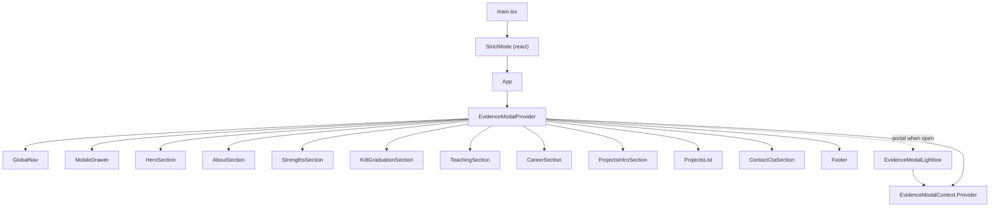
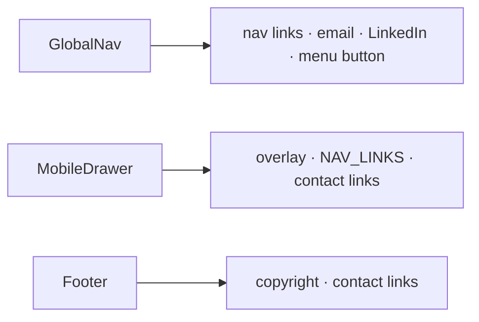
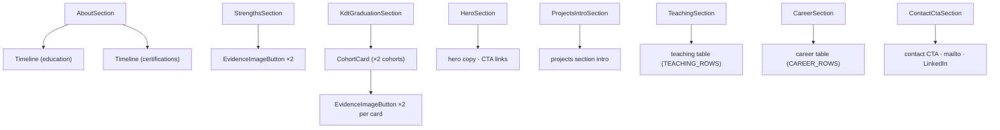
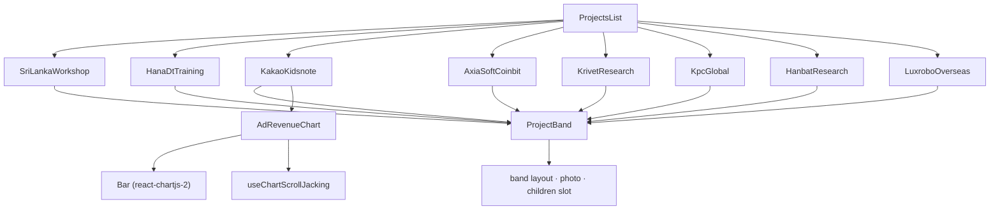
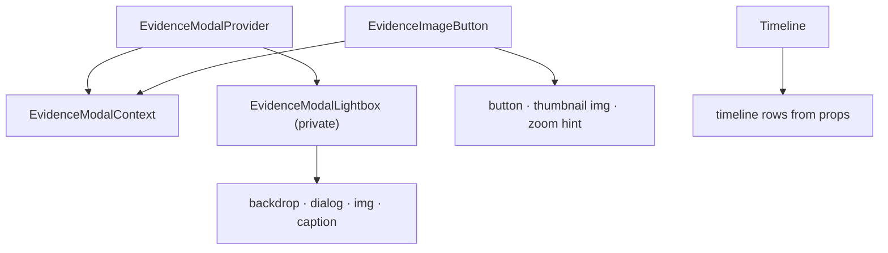
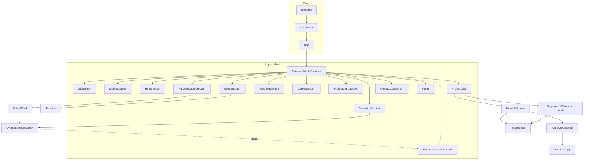

# Component Tree — profile-vibe

React component hierarchy for the Vite app in `app/`. Leaf nodes are mostly presentational (`<section>`, tables, native elements). External libraries are shown where they are direct JSX children.

## Entry & shell

## Layout (`components/layout/`)

## Sections (`components/sections/`)

## Projects (`components/projects/`)

`ProjectsList.tsx` defines eight private band components (not exported); each renders one `<ProjectBand>` with project-specific copy, tables, and metrics. Only **KakaoKidsnote** embeds **AdRevenueChart**.

## UI & evidence modal (`components/ui/`)

**Evidence flow:** `EvidenceImageButton` calls `useEvidenceModal().open()` → provider sets state → `createPortal(EvidenceModalLightbox)` on `document.body`.

## Full tree (condensed)

## Non-component modules (reference)

| Path | Role |
|------|------|
| `app/src/hooks/useChartScrollJacking.ts` | Scroll-sync for `AdRevenueChart` sticky scroller |
| `app/src/data/*.ts` | Static content: `nav`, `about`, `career`, `teaching`, `kdt` |
| `app/src/types/index.ts` | Shared TypeScript types |
| `app/src/components/ui/EvidenceModalContext.ts` | Context + `useEvidenceModal` hook |

## File index (`.tsx` only, app source)

| File | Export(s) |
|------|-----------|
| `main.tsx` | — (bootstrap) |
| `App.tsx` | `App` (default) |
| `layout/GlobalNav.tsx` | `GlobalNav` |
| `layout/MobileDrawer.tsx` | `MobileDrawer` |
| `layout/Footer.tsx` | `Footer` |
| `sections/HeroSection.tsx` | `HeroSection` |
| `sections/AboutSection.tsx` | `AboutSection` |
| `sections/StrengthsSection.tsx` | `StrengthsSection` |
| `sections/KdtGraduationSection.tsx` | `KdtGraduationSection`, `CohortCard` (private) |
| `sections/TeachingSection.tsx` | `TeachingSection` |
| `sections/CareerSection.tsx` | `CareerSection` |
| `sections/ProjectsIntroSection.tsx` | `ProjectsIntroSection` |
| `sections/ContactCtaSection.tsx` | `ContactCtaSection` |
| `projects/ProjectsList.tsx` | `ProjectsList` + 8 private band components |
| `projects/ProjectBand.tsx` | `ProjectBand` |
| `projects/AdRevenueChart.tsx` | `AdRevenueChart` |
| `ui/Timeline.tsx` | `Timeline` |
| `ui/EvidenceImageButton.tsx` | `EvidenceImageButton` |
| `ui/EvidenceModal.tsx` | `EvidenceModalProvider`, `EvidenceModalLightbox` (private) |
