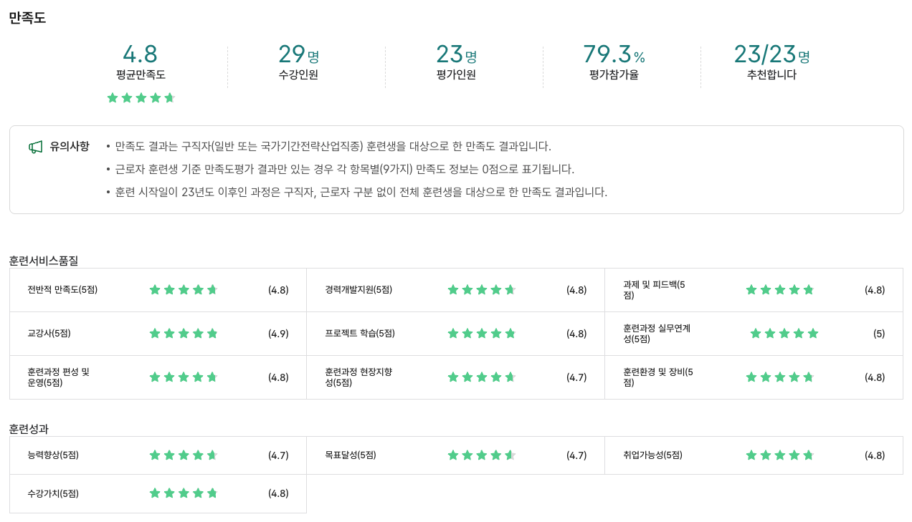
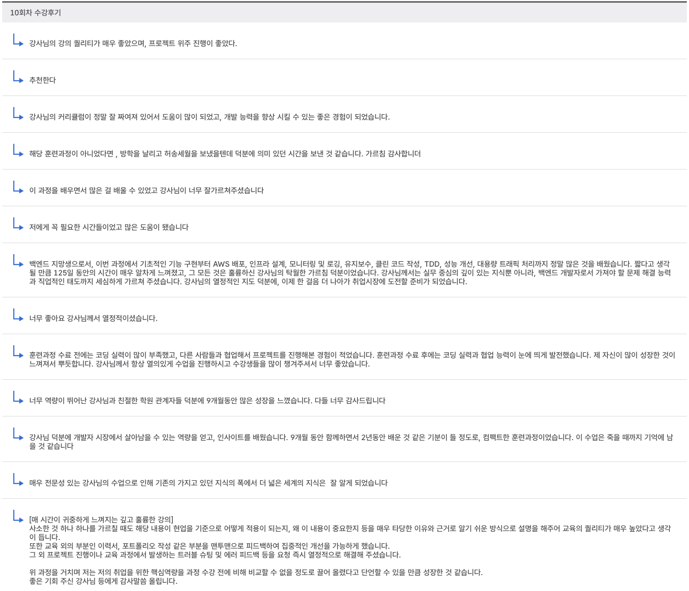
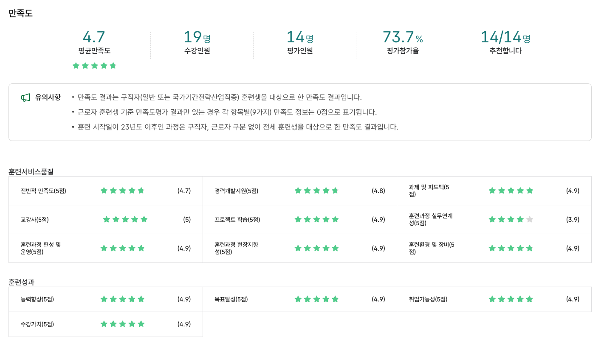
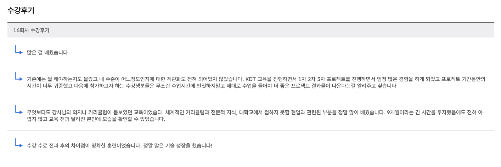

## 2024년 삼육대학교 KDT 1,000 시간 장기과정    : **29명 중 29명**** 수료 ****`100%`****, 교육과정 만족도 조사 제출 인원 전원 추천 ****`100%`**
<columns>
	<column>
		

		
**만족도 조사**

			
			<empty-block/>
		

	</column>
	<column>
		

		
**수강 후기**

			
		

	</column>
</columns>
## 2025년 삼육대학교 KDT 1,000 시간 장기과정    : 1**9명 중 19명**** 수료 ****`100%`****, 교육과정 만족도 조사 제출 인원 전원 추천 ****`100%`**
<columns>
	<column>
		

		
**만족도 조사**

			
		

	</column>
	<column>
		

		
**수강 후기**

			
		

	</column>
</columns>
<empty-block/>